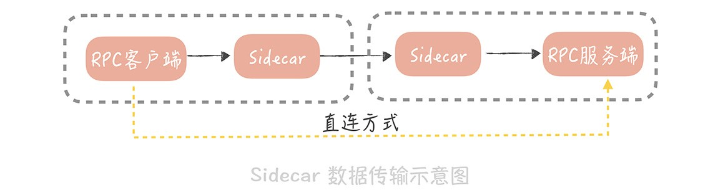
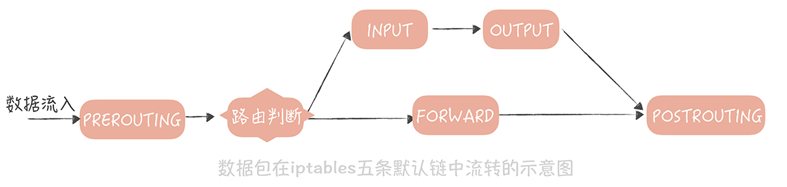
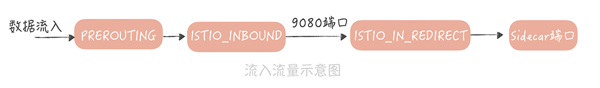
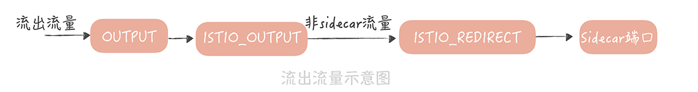

# Service Mesh

1. 为什么
   1. 不同的开发语言无法使用之前积累的 服务治理策略（负载均衡、熔断降级、流量控制、打印分布式追踪日志等），都需要重新实现
   3. 现有服务治理策略的解决方案对应用不透明，强侵入
   
2. 是什么
   1. 一种将业务与通信基础设施分离的技术，主要处理服务之间的通信
   2. “关注点分离”的实现，使服务治理对应用保持透明，同时解决跨语言场景下，服务治理策略的复用问题
   
3. 常见实现

   1. Istio

      

      1. 数据平面

          Sidecar（Istio 使用Envoy作为 Sidecar 的实现）

      2. 控制平面

         负责服务治理策略的执行

   2. Linkerd

   3. SOFAMesh

      > 已停止维护，贡献给了Istio

4. 怎么做

   1. 实现思想

      * Sidecar（边车）

        在应用程序同主机上部署一个代理程序，服务之间的通信从客户端和服务端直连，变成了先经过Sidecar处理，再到应用侧

        >RPC 客户端数据包流向：
        >
        >RPC 客户端 -> 与自身同主机部署的 Sidecar（处理服务发现、负载均衡、服务路由、流量控制之后）-> 指定服务节点的 Sidecar（记录访问日志、记录分布式追踪日志、限流之后）-> RPC 服务端

        

   2. 实现方案

      * 如何将流量转发到 Sidecar中

        1. iptables

           > Istio 默认使用该方案，属于流量劫持的方案

           > Iptables 是 Linux 内核中，防火墙软件 Netfilter 的管理工具，它位于用户空间，可以控制 Netfilter，实现地址转换的功能。在 iptables 中默认有五条链，你可以把这五条链，当作数据包流转过程中的五个步骤，依次为 PREROUTING，INPUT，FORWARD，OUTPUT 和 POSTROUTING。数据包传输的大体流程如下
           >
           > 数据包以 PREROUTING 链作为入口，当数据包目的地为本机时，它们也都会流经到 OUTPUT 链。所以，我们可以在这两个链上，增加一些规则，将数据包重定向

           流入流量实现

           

           流出流量实现

           

           1. 优势
              1. 对业务完全透明
           2. 缺点
              1. 高并发下，性能上会有损耗

        2. 轻量级客户端

           > 国内大厂较为喜欢选择的方案，属于流量转发的方案

           

           1. 前提
              1. Sidecar使用一个轻量级客户端实现
              2. RPC 客户端通过配置的方式知道Sidecar的部署端口
              3. 服务节点启动时，委托服务端 Sidecar向注册中心注册节点
           2. 流程
              1. RPC 客户端发起调用，实际上调用的是本机Sidecar的服务
              2. Sidecar 在转发请求之前，先执行一些服务治理的策略，然后再发送实际请求到服务端的 Sidecar
              3. 服务端的 Sidecar 完成服务治理策略后，将流量转发到实际服务结点上

        3. [Cilium](https://cilium.io/)

## 思考

1. 技术的迭代方向是让通用的技术分层和下沉

   先分层，关注点的分离，边界的划分，逻辑的聚合

   再将通用技术的下沉，实现技术的复用，可扩展，可移植

   网络OSI模型、TCP/IP模型；操作系统的内核态、用户态；云SaaS、PaaS、IaaS层；到项目包结构的分层，好像都是这么个理，划清各层的边界，让各层更加专注各自的实现

   ServiceMesh其实也是践行着这个路，让可复用的，业务相关性底的，做分离，做下沉

   引用周志明老师在软件架构课里的一句话

   > 上帝的归上帝，凯撒的归凯撒，业务与技术完全分离，远程与本地完全透明，我想也许这就是分布式架构最好的时代吧。

## 参考资料

* 极客时间-高并发系统设计 40 问
* 极客时间-周志明的软件架构课

