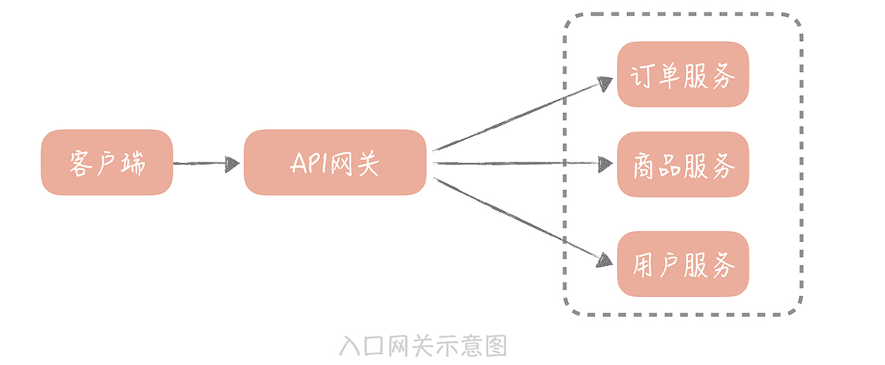
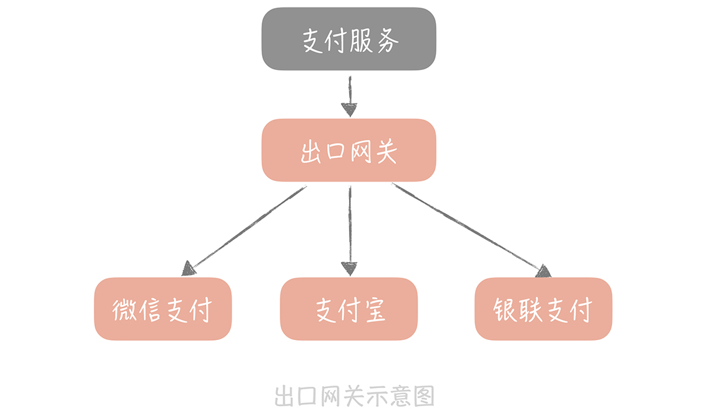
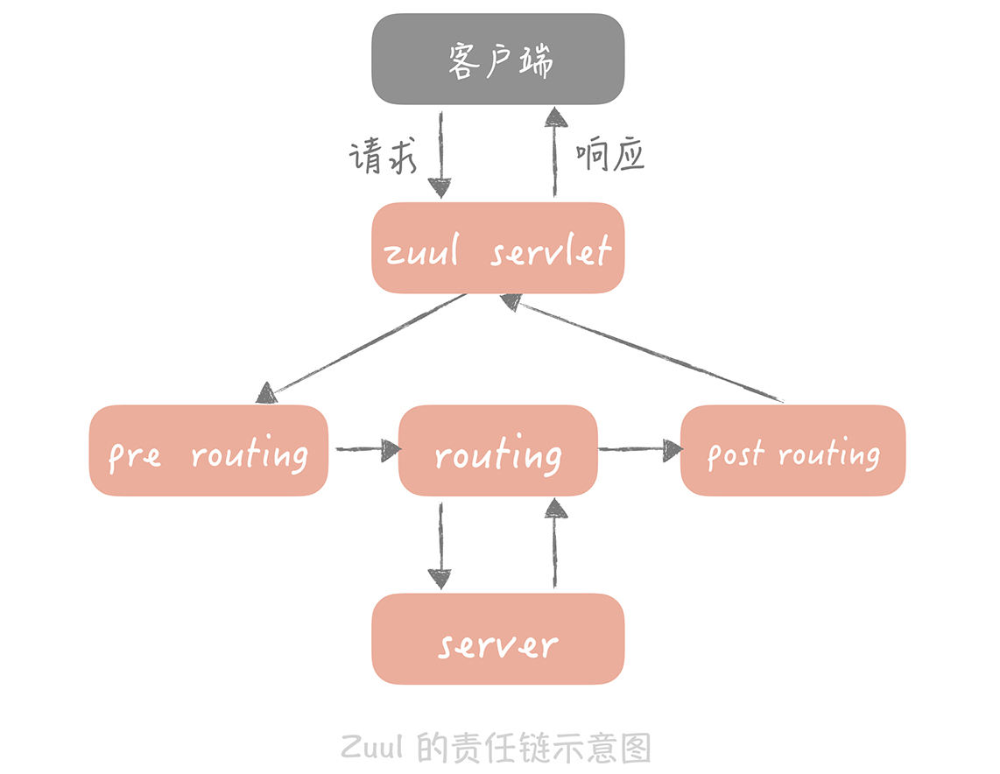

# API网关

1. 为什么

   1. 对外功能的聚合 如限流/鉴权等
   2. 屏蔽内部的实现协议
   3. 对系统出入实现统一管控

2. 常见实现

   1. 业务网关 （Java)
      1. Zuul
      2. SpringCloud Gateway
      3. Apache ShenYu

   2. 流量网关
      1. Kong
      2. ..

3. 分类

   1. 入口网关

      

      负载均衡服务器和应用服务器之间

      1. 作用

         1. 屏蔽内部实现，提供客户端一个统一的接入地址

            无论服务是RPC还是Webservice还是http，都由网关统一提供对外服务，屏蔽内部细节

         2. 植入服务治理或安全管控，如统一熔断、降级，流量控制和分流，或黑白名单等

         3. 实现客户端的认证和授权

         4. 统一日志记录

   2. 出口网关

      

      在应用服务器和第三方系统之间，部署出口网关。

      1. 作用
         1. 对调用外部的 API 做统一的认证、授权，审计以及访问控制

4. 实现思路

   1. 合适的I/O模型

      >Zuul，在 1.0 版本的时候使用的是同步阻塞 I/O 模型，实质是一个Servlet，在2.0版本改造成了一个 netty server，采用 I/O 多路复用的模型处理接入的 I/O 请求，并且将之前同步阻塞调用后端服务的方式，改造成使用 netty client（netty 客户端）非阻塞调用的方式。改造之后，Netfix 团队经过测试发现性能提升了 20% 左右

   2. 保留扩展性，可随时增加/减少一些逻辑（热插拔）

      > 可基于filter形式完成，并通过职责链的设计模式组合 filter+实际接口，解耦 filter 之间的关系，实现该功能
      >
      > 例如 Zuul 的 filter 定义了pre routing filter（路由前过滤器）、routing filter（路由过滤器）和 after routing filter（路由后过滤器），可根据需要在特定位置进行逻辑处理
      >
      > 

   3. 使用线程池并行执行请求，并针对不同服务做线程隔离保护

      1. 如果你后端的服务拆分得不多，可以针对不同的服务，采用不同的线程池
      2. 在线程池内部可以针对不同的服务，甚至不同的接口做线程的保护。比如说，线程池的最大线程数是 1000，那么可以给每个服务设置一个最多可以使用的配额。

## 思考

1. 分布式组件中，很多都强调I/O模型

   在分布式系统中，涉及服务之间的调用的，通过网络进行调用的，对 I/O 模型都会比较重视，I/O 模型的选择基本会决定了这个组件性能的上限

   毕竟基础建设决定上层建筑

2. 微服务的拆分，可先通过网关屏蔽内部变化

   这个纯属经验之谈，曾经我们想把服务再做拆分及模块化，以及做一些外部请求的限流.当时想的是先做网关，因为网关能屏蔽内部的实现，接口上的变动产生的向前兼容问题只需要在网关上做配置就行，各个服务模块不需要关心；而对外的限流熔断也可以在网关上统一做处理，各个服务各个模块只需要重点关注业务就成。

   虽然后来因为非技术的原因没有实施下去，但现在回想起来觉得当时的设计还是正确的..

## 参考资料

* 极客时间-高并发系统设计 40 问 