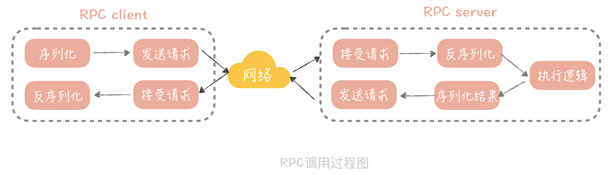

# 如何设计一个RPC框架

1. 是什么

   RPC（Remote Procedure Call，远程过程调用），指的是通过网络，调用另一台计算机上部署服务的技术

   RPC 框架封装了网络调用的细节，让你像调用本地服务一样，调用远程部署的服务

   RPC是一种规范，只要是封装了网络调用的细节，能够实现远程调用其他服务

   为了让计算机能够跟调用本地方法一样，去调用远程方法

   1. 常见框架

      1. Dubbo

      2. Grpc

      3. Thirft

      4. Motan

      5. RMI(Remote Method Invocation)

         让 Java 程序通过网络，调用另一台机器上的 Java 对象的方法，是 J2EE 时代大名鼎鼎的 EJB 的实现基础

         * 缺陷
           * RMI 使用专为 Java 远程对象定制的协议 JRMP（Java Remote Messaging Protocol）进行通信，这限制了它的通信双方，只能是 Java 语言的程序，无法实现跨语言通信；
           * RMI 使用 Java 原生的对象序列化方式，生成的字节数组空间较大，效率很差。

      6. Web Service

         使用 HTTP+SOAP 协议，保证了调用可以跨语言，跨平台，也可以认为是 RPC 的一种实现方

2. RPC调用步骤

   

   * 在一次 RPC 调用过程中，客户端首先会将调用的类名、方法名、参数名、参数值等信息，序列化成二进制流；

   * 然后客户端将二进制流，通过网络发送给服务端；

   * 服务端接收到二进制流之后，将它反序列化，得到需要调用的类名、方法名、参数名和参数值，再通过动态代理的方式，调用对应的方法得到返回值；

   * 服务端将返回值序列化，再通过网络发送给客户端；

   * 客户端对结果反序列化之后，就可以得到调用的结果了。

3. 需要解决的问题

   1. 如何表示数据

      包括了传递给方法的参数，以及方法的返回值。无论是将参数传递给另外一个进程，还是从另外一个进程中取回执行结果

      需要将交互双方涉及的数据，转换为某种事先约定好的中立数据流格式来传输，将数据流转换回不同语言中对应的数据类型来使用

      > 定义合适的序列化协议

   2. 如何传递数据

      如何通过网络，在两个服务 Endpoint 之间相互操作、交换数据

      需要选择合适的协议

   3. 如何表示方法

      如何把调用的方法转换为进程地址空间中方法入口位置的指针

      需要有语言无关的，能标识单一方法的标准

4. 优化方向

   1. 合适的网络模型及参数调优

      有针对性地调整网络参数，以优化网络传输性能

      参考I/O模型的选择，可使用**多路 I/O 复用**

      基于业务情况的网络参数调优，例如tcp_nodelay参数的选择

      >tcp 协议的包头有 20 字节，ip 协议的包头也有 20 字节，如果仅仅传输 1 字节的数据，在网络上传输的就有 20 + 20 + 1 = 41 字节，其中真正有用的数据只有 1 个字节，这对效率和带宽是极大的浪费。所以在 1984 年的时候，John Nagle 提出了以他的名字命名的 Nagle`s 算法，**他期望：**
      >
      >如果是连续的小数据包，大小没有一个 MSS（Maximum Segment
      >
      >Size，最大分段大小），并且还没有收到之前发送的数据包的 Ack 信息，那么这些小数据包就会在发送端暂存起来，直到小数据包累积到一个 MSS，或者收到一个 Ack 为止。
      >
      >这原本是为了减少不必要的网络传输，但是如果接收端开启了 DelayedACK（延迟 ACK 的发送，这样可以合并多个 ACK，提升网络传输效率），**那就会发生，**发送端发送第一个数据包后，接收端没有返回 ACK，这时发送端发送了第二个数据包，因为 Nagle`s 算法的存在，并且第一个发送包的 ACK 还没有返回，所以第二个包会暂存起来。而 DelayedACK 的超时时间，默认是 40ms，所以一旦到了 40ms，接收端回给发送端 ACK，那么发送端才会发送第二个包，**这样就增加了延迟。**

   2. 合适的序列化方式

      提升封包、解包的性能

      一次 RPC 调用需要经历两次数据序列化的过程，和两次数据反序列化的过程

      > 序列化，是将传输对象转换成二进制串的过程，而反序列化则是相反的动作

      考虑点：

      1. 性能

         性能包括时间上的开销和空间上的开销

         * 时间上的开销就是序列化和反序列化的速度
         * 空间上的开销则是序列化后的二进制串的大小，过大的二进制串也会占据传输带宽，影响传输效率

      2. 是否跨语言跨平台

         在非单一语言的产品中，需考虑该问题

      3. 扩展性

         对于增减字段的向前兼容性和向后兼容性问题

      现成方案：

      1. JSON

         简单易用，但占用空间较大

      2. Thrift /Protobuf

         引入 IDL（Interface description language），通过特定的编译器将它转换成各语言对应的代码，从而实现跨语言的特点。也因为引入IDL会在使用上带来一些不便

## 思考

1. RPC框架的扩展性

   主要想说Dubbo的SPI机制，这个感觉得单独开一篇。

   SPI极大提升了应用的可扩展性，Dubbo的SPI机制，以及SpringBoot的SPI机制（不知道能不能这么称呼）都为上层使用者提供了不侵入原框架而实现'变动'的能力

   这种能力在为产品赋能可扩展性的时候，也一样重要。目前看，2B行业的很多产品，客户要求私有化部署之外，还希望能提供二次开发的能力。而这个二次开发更多的是基于现有平台的扩展能力，能基于现有平台的框架快速开发的能力。

   给客户开源所有代码的场景目前来看不太现实（钱够的话另说），客户也其实更多想基于现有能力做一些符合他们业务场景的定制性的开发。这时候，产品足够的内聚并开放一些SPI的能力，就显得非常有竞争力了。

## 参考资料

* 极客时间-周志明的软件架构课
* 极客时间-高并发系统设计 40 问 