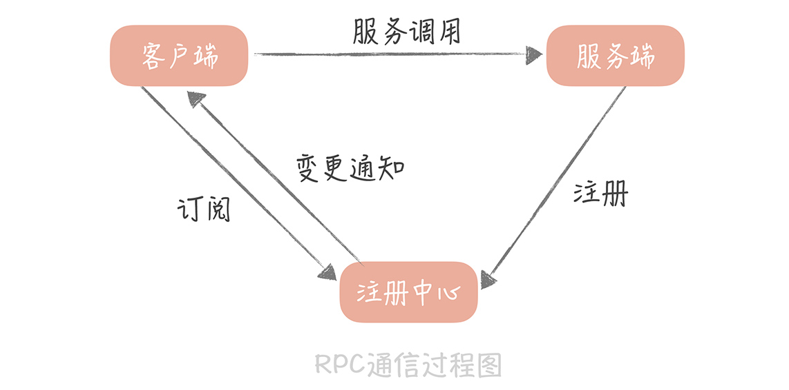

# 服务发现的设计

1. 为什么

   1. 服务的扩容/缩容/故障等情况，需要同步修改调用者的配置
   2. 服务的变动对调用者不够透明

2. 常见框架实现

   1. Zookeeper
   2. Etcd
   3. Nacos
   4. Eureka

3. 设计方向

   1. 服务地址的存储维护（元数据维护）

      1. 服务状态管理

         1. 主动探测

            由注册中心每隔一段时间探测服务节点是否可用

            1. 问题
               * 所有的 RPC 服务端都需要开放一个端口给注册中心探测，在同主机的情况下可能出现端口不够用的问题
               * 实例较多后探测成本较高，探测时间较长

         2. 被动探测（心跳模式）

            服务节点在向注册中心注册后，定期向注册中心续约（发送心跳包），注册中心在接受到心跳包之后，会更新这个节点的最近续约时间。

            注册中心存在一个定时器，定期检测当前时间和节点，最近续约时间的差值，如果达到一个阈值，就认为该服务节点不可用，将会对服务节点进行下线

   2. 元数据变动时通知客户端

      1. 通过长连接主动推送
      2. 客户端向注册中心长轮询/按某一时间轮询

4. 引入服务发现后的调用流程

   

   * 客户端会与注册中心建立连接，并且告诉注册中心，它对哪一组服务感兴趣；
   * 服务端向注册中心注册服务后，注册中心会将最新的服务注册信息通知给客户端；
   * 客户端拿到服务端的地址之后就可以向服务端发起调用请求了

5. 异常情况及处理方式

   1. 摘除的节点占到了服务集群节点数的某个比例（阈值），就停止摘除服务节点，并告警

      Eureka也有类似的策略，用于防止注册中心与服务节点出现大规模网络异常时，大量下线服务节点，导致业务异常

   2. 通知风暴

      注册的服务节点过多时，节点变化导致大量变化消息同步

      解决方案：

      * 控制一组注册中心管理的服务集群的规模
      * 扩容注册中心节点的方式
      * 规范使用，例如变更节点只发送变更节点的信息（增量信息）
      * 制定保护策略，比如说如果通知的消息量达到某一个阈值就停止变更通知

## 思考

1. 摘除保护是否应该存在

   这个问题其实感觉得跟业务做结合，业务上会存在大量的节点下线吗？理论上应该不会，所以有保护的情况下，实际上是一种兜底。但也只能是一种兜底，靠摘除保护来保证服务的稳定性在我看来是不应该的，更多应该在如何避免触发非预期的大量节点下线。

2. 服务发现（注册中心）应该是AP还是CP

   这个问题好像很多地方都有提及，大部分都认为是AP

   我也认为是AP，在我看来这个问题可以转变为服务节点实例的发现是否需要强一致性的问题。

   贴近业务点说，有一个新增的服务节点，这时候上游服务需要马上感知到吗？好像也不用，因为有其他对等的服务可以支撑；而如果有一个节点下线呢？这时候最好可能得要，不然调用到该节点可能会出现异常，影响业务，但其实，这种场景下也可以通过重试机制请求别的对等节点来尽可能避免对业务的影响。

   再换个角度看，如果有一个注册中心的节点出现了问题，不能跟其他注册中心的节点做通讯时，其他注册中心节点是否需要'暂停服务'，不向客户端提供服务地址？结合前一个问题来看，哪怕提供给客户端的服务地址不是最新的，也能保证服务处于较为正常的水平运行；但如果不再向客户端提供服务地址了，那可能会因为无法进行服务调用而引起整个产品的不可用，得不偿失。

   在现有的基础设施下，同时做到可用和强一致性的成本是比较高的，在分布式领域也算是一个较为棘手的问题。个人猜测也可能因为如此，才会有CAP的「取舍」，才会有BASE理论的诞生。如果能做到''我全都要'，谁会不乐意呢？

## 参考资料

* 极客时间-高并发系统设计 40 问 