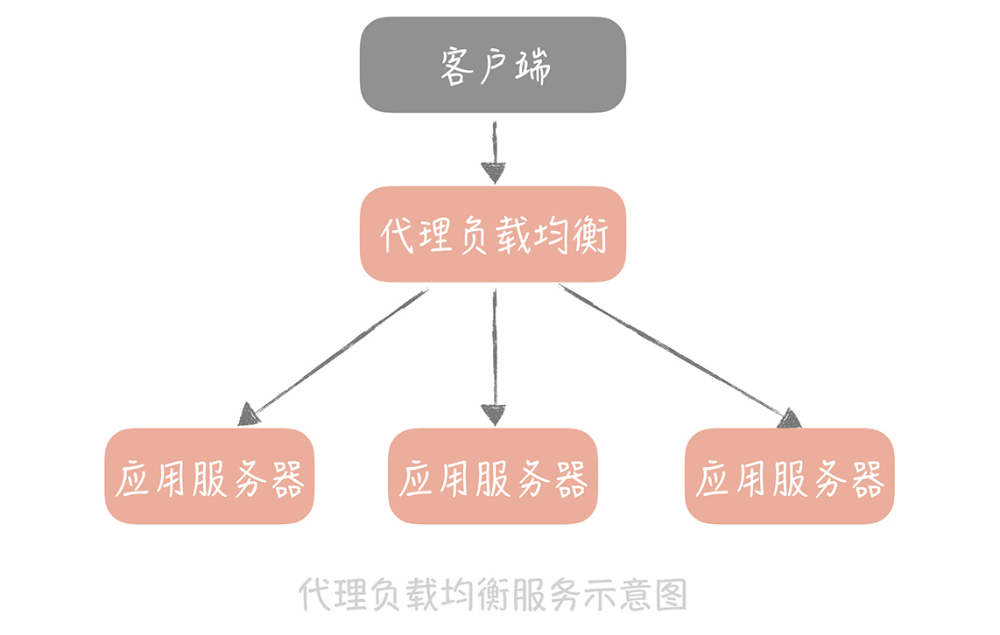
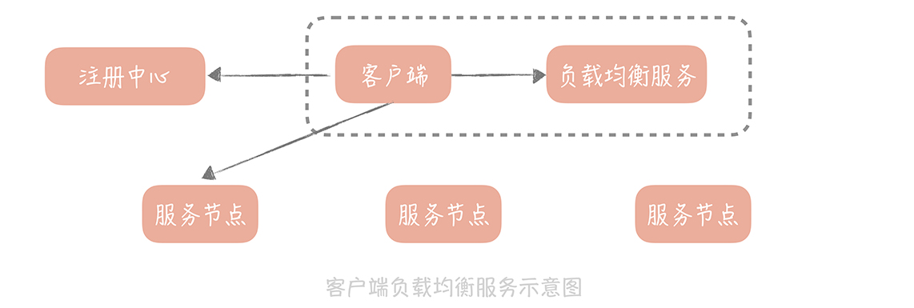

# 负载均衡

1. 是什么

   1. 流量的入口，屏蔽服务节点的部署细节，实现无感知的扩容
   2. 实现流量分发，用于提升下层的横向扩展能力，减少单个实例的请求量

2. 分类

   1. 服务端负载均衡（代理类负载均衡）

      

      1. 四层负载 LVS
      2. 七层负载 Nginx

   2. 客户端负载均衡

      

      一般和客户端应用，部署在一个进程中，提供多种选择节点的策略，最终为客户端应用提供一个最佳的，可用的服务端节点

      一般配合注册中心使用，注册中心提供完整列表，客户端拿到列表之后使用负载均衡服务的策略选取一个合适的节点

3. 实现的功能

   1. 负载均衡策略

      1. 静态策略
         从配置文件内配置的节点按照一定规则获取

         1. 轮询策略（RoundRobin，RR）

            记录上次请求后端服务的地址或者序号，然后在请求时，按照服务列表的顺序，请求下一个后端服务节点

         2. 加权轮询

            在轮询基础上，支持基于权重的分配

         3. ip_hash

            基于源ip做hash计算得到节点，适合需要把流量转发到同一节点上，但可能造成节点流量不均

         4. url_hash

         5. 一致性hash

         6. 随机

      2. 动态策略

         会依据后端服务的一些负载特性，来决定要选择哪一个服务节点

         1. LeastAcive 优先选择活跃连接数最少的服务
         2. WeightedResponseTimeRule 基于响应时间计算权重分配
         3. BestAvailableRule  最小并发数策略

   2. 节点可用性监测

      保证进行负载的节点是可用的

      基于注册中心提供完整列表的，可由注册中心实现该功能

      1. Nginx Lua下基于nginx_upstream_check_module模块实现

         由负载设备探测下游服务是否可用，达到一定阈值自动摘除

         

4. 实战

   1. 同时部署LVS+Nginx

      1. LVS做四层转发，偏向于承担更高点的并发

         >在网络栈的四层做请求包的转发，请求包转发之后，由客户端和后端服务直接建立连接，后续的响应包不会再经过 LVS 服务器

      2. Nginx做七层转发，偏向于业务配置及业务感知

         >可以承担每秒几万次的请求，并且它在配置上更加灵活，支持URL级别的转发，还可以感知后端服务是否出现问题

## 参考资料

* 极客时间-高并发系统设计 40 问 