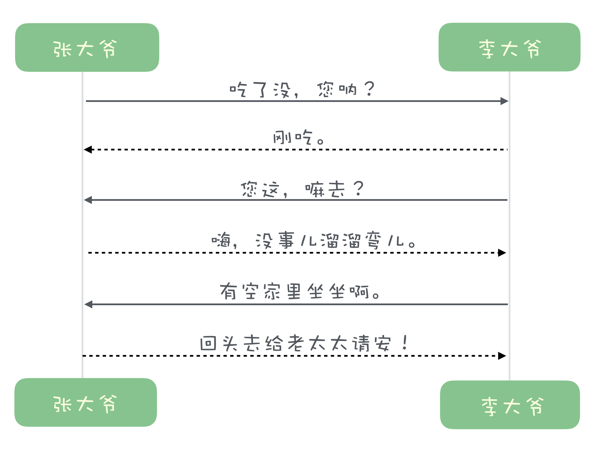
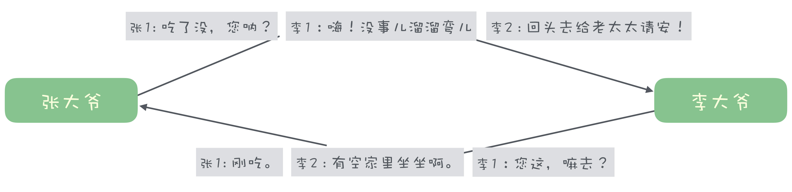

# 传输协议设计

1. 是什么
   1. 应用系统之间对话的语言

2. 为什么
   1. 定义应用系统间传输规范
   2. 防止应用系统处理时出现歧义情况
   3. 提升应用系统间传输效率

3. 设计方向

   1. 粘包拆包

      > 断句问题，指收到的数据可能会分段或合并

      * 定义特殊分隔符

        > 如HTTP/1协议使用\r\n分隔

      * 预置长度

        > 每段数据前标识长度，告知读取方读取指定长度信息

        > 较为普遍使用

   2. 高效收发

      1. 单工通信

         > 任一时刻数据只能单向传输，一来一回 如HTTP/1协议
         >
         > 效率较低

         

         > TCP是全双工，如果使用TCP且用单工通信较为浪费性能

      2. 双工通信

         > 边听边说，但是可能会有乱序问题

         > 实际上业务不一定关心返回顺序，只关心请求是否得到了响应，因此可通过标识序号等方式满足

         

## 参考资料

* 极客时间-消息队列高手课