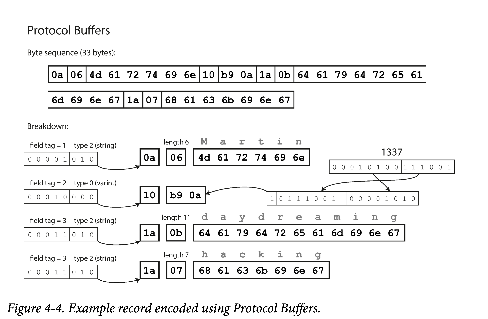

# 序列化与反序列化

1. 是什么

   * 结构化的数据与字节流之间的双向转换
   * 通过一定的协议将数据字段进行转换

2. 为什么

   * 文件存储或网络传输都是二进制序列，在内存中的结构体需要进行转换才能被使用

   * 屏蔽内存中对象引用/其他元数据信息，做到更高的通用性

     > 为什么不把内存里的数据直接进行传输或存储？

3. 设计方向

   > 不存在一种序列化实现在各个方面都是最优的
   >
   > 易于阅读和信息密度是矛盾的
   >
   > 实现的复杂度和性能是矛盾的

   * 易读性

     > 序列化后能被人直观看懂的，例如文本形式的实现: JSON/XML

   * 复杂度

     > 使用序列化和反序列化工具的成本

   * 性能

     > 序列化与反序列化所消耗的时间

   * 信息密度

     > 序列化后的报文长度

   * 兼容性

     * 向前兼容

       > 可以读取旧版本代码写入的数据

     * 向后兼容

       > 可以读取新版本代码写入的数据

   > 高性能实现一般追求的是时间短，信息密度高（报文长度小）
   >
   > 不追求易读性

4. 常见实现

   1. 二进制编码

      > 节省空间、性能好 但是可读性差

      * 基于IDL

        > 接口定义语言（IDL）是编程语言无关的，可以利用相关代码生成工具，定义编解码的格式

        * Protobuf

          

        * Thrift

      * Kryo

      * Hessian

   2. 文本编码

      > 好处在于肉眼可读，坏处在于不够紧凑，占空间较多，万物皆字符串不区分类型

      * JSON

      * XML

## 参考资料

* 极客时间-消息队列高手课
* 《Designing Data-Intensive Applications》
