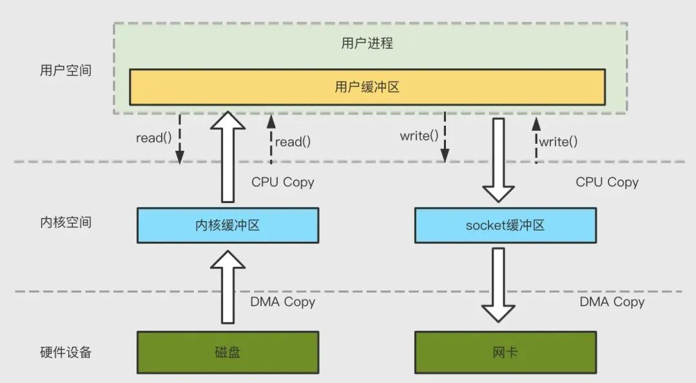
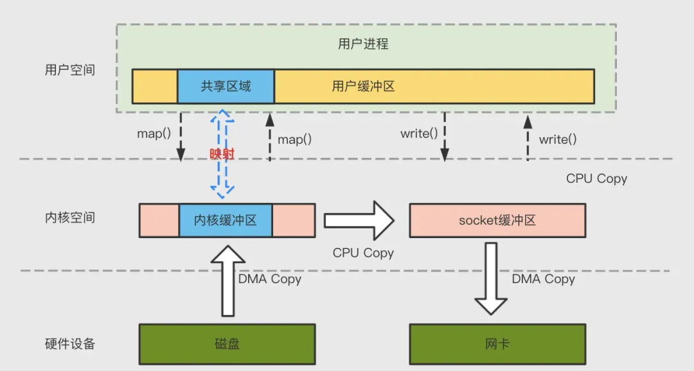
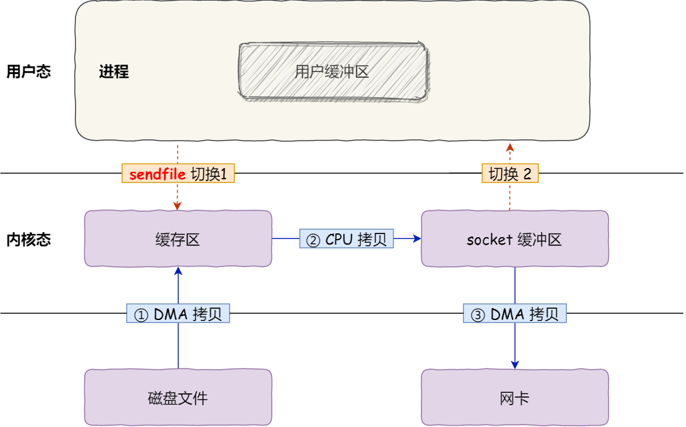
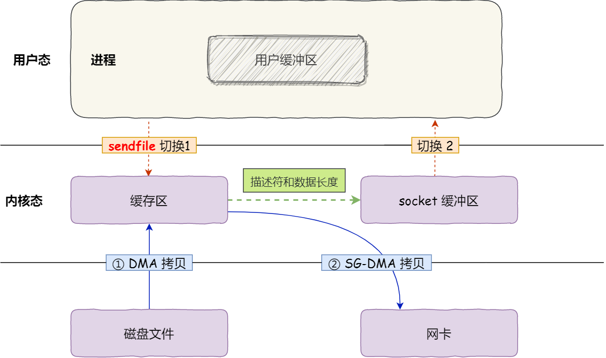

# 零拷贝

1. 为什么

   1. 不同硬件之间的读写速度相差很大
   2. 传统文件传输性能过于糟糕

2. DMA

   Direct Memory Access，直接存储器访问，为提供设备间的高速数据传输

   > 早期 DMA 只存在在主板上，如今的IO设备都有自己的DMA

   1. 没有DMA
      1. 过程

         > 由CPU进行数据拷贝

         1. CPU 发出对应的指令到IO设备
         2. IO设备收到指令后开始准备数据，产生中断
         3. CPU收到中断后从IO设备拷贝数据到内核空间
         4. CPU根据需要把数据拷贝到用户空间

      2. 缺点

         1. CPU直接参与数据拷贝，大材小用

   2. 拥有DMA

      1. 过程

         > CPU通知DMA将数据拷贝到内核空间，坐享其成

         1. CPU发出对应指令到DMA设备
         2. DMA设备请求IO设备
         3. IO设备收到指令后开始准备数据，产生中断
         4. DMA将数据拷贝到内核空间
         5. 数据就绪时，DMA发送中断信号给CPU
         6. CPU根据需要把数据拷贝到用户空间

3. 传统数据传输

   

   一次文件传输发生 4 次上下文切换与 4 次数据拷贝（两次CPU，两次DMA)

   * 优化核心

     * 减少上下文切换

       > 上下文切换是不可避免的，因为用户态没有权限直接操作IO设备，需要切换用内核态由操作系统完成
       >
       > 因此一次传输至少会发生两次上下文切换，用户态->内核态->用户态

     * 减少数据拷贝

       对于不进行加工的数据，无需将数据拷贝到用户态

4. 零拷贝的实现

   > 零拷贝的含义是CPU不参与拷贝

   1. mmap+write

      

      内存映射技术，将内核态缓冲区与用户态缓存区做映射，实现内核缓冲区与应用程序内存的共享，减少一次拷贝

      > mmap相当于传统数据传输中的read函数作用，只是实现上少了一次从内核态拷贝到用户态的CPU拷贝，而是通过映射实现

      一次文件传输发生 4 次上下文切换与 3 次数据拷贝(一次CPU，两次DMA)

   2. sendfile

      

   数据不再经过用户缓冲区，由一个系统调用函数(sendfile)直接完成数据传输

   > 也因为数据不经过用户缓冲区，因此传输的数据是不能做修改的（包括压缩等）

   一次文件传输发生2次上下文切换与3次数据拷贝（一次CPU，两次DMA）

   3. sendfile + SG-DMA

      > 对于Linux 版本 > 2.4，网卡支持 SG-DMA 技术s

      

      内核缓冲区只需提供描述符合数据长度到socket缓冲区，不再需要CPU拷贝数据到socket缓冲区，后续由SG-DMA从内核缓冲区直接搬运数据，不需要再经过socket缓冲区

      一次文件传输发生2次上下文切换与2次数据拷贝（两次DMA）

5. 零拷贝的缺点

   1. 数据不支持在应用层面加工

## 思考

## 参考资料

* [小林coding-什么是零拷贝](https://xiaolincoding.com/os/8_network_system/zero_copy.html)
* [Kafka 高可靠高性能原理探究](https://mp.weixin.qq.com/s/_g11mmmQse6KrkUE8x4abQ)