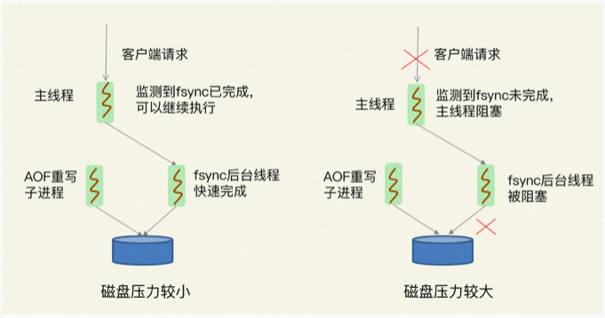

# Redis

1. I/O模型

   1. Redis6.0之前

      **网络 IO** 和**命令执行**是由一个线程来完成

      随着网络硬件的性能提升，Redis 的性能瓶颈有可能会出现在网络 IO 的处理上

      即**单个主线程处理网络请求的速度跟不上底层网络硬件的速度**

      * 网络I/O模型 

        `epoll`机制实现 IO 多路复用，单线程处理，涉及用户态/内核态切换

        

        * 从`socket`中读取请求数据，会从内核态将数据拷贝到用户态 （`read`调用）

        * 将数据回写到`socket`，会将数据从用户态拷贝到内核态 （`write`调用）

   2. Redis6.0后

      多个 IO 线程来处理网络请求，提高网络请求处理的并行度，但多 IO 线程只用于处理网络请求，**对于命令处理，Redis 仍然使用单线程处理**

2. 过期策略

   1. 被动过期：只有当访问某个 key 时，才判断这个 key 是否已过期，如果已过期，则从实例中删除
      * 优点：只在从数据库取出 key 的时候发生，对 CPU 时间的占用较少
      * 缺点：大量key过期且很久一段时间未获取过，会造成内存泄漏（无效`key`占用了大量的内存）
   2. 主动过期：
      * 步骤
        1. Redis 每`100ms`执行以下步骤：
           1. 抽样检查附加了`TTL`的 20 个随机`key`(环境变量`ACTIVE_EXPIRE_CYCLE_LOOKUPS_PER_LOOP`**，默认为 20**)；
           2. 删除抽样中所有过期的`key；`
           3. 如果超过`25%`的`key`过期且任务的执行耗时小于25ms，重复步骤 1。
      * 优点：通过限制删除操作的时长和频率，来限制删除操作对 CPU 时间的占用；同时解决`被动方式`中无效`key`存留的问题
      * 缺点：仍然可能有最高达到`25%`**的无效**`key`**存留**；在`CPU时间`友好方面，不如`被动方式`，主动方式会**block**住主线程

3. 淘汰策略

   1. allkeys-lru：不管 key 是否设置了过期，淘汰最近最少访问的 key
   2. allkeys-random：不管 key 是否设置了过期，随机淘汰 key
   3. allkeys-ttl：不管 key 是否设置了过期，淘汰即将过期的 key
   4. allkeys-lfu：不管 key 是否设置了过期，淘汰访问频率最低的 key（4.0+版本支持）
   5. volatile-lru：只淘汰最近最少访问、并设置了过期时间的 key
   6. volatile-random：只随机淘汰设置了过期时间的 key
   7. volatile-lfu：只淘汰访问频率最低、并设置了过期时间 key（4.0+版本支持）
   8. noeviction：不淘汰任何 key，实例内存达到 maxmeory 后，再写入新数据直接返回错误

   最常使用的是 allkeys-lru / volatile-lru 淘汰策略，它们的处理逻辑是，每次从实例中随机取出一批 key（这个数量可配置），然后淘汰一个最少访问的 key，之后把剩下的 key 暂存到一个池子中，继续随机取一批 key，并与之前池子中的 key 比较，再淘汰一个最少访问的 key。以此往复，直到实例内存降到 maxmemory 之下

4. 持久化

   

   

   1. RDB

   2. AOF
      1. 工作原理
         1. Redis 执行写命令后，把这个命令写入到 AOF 文件内存中（write 系统调用）
         
            >当系统范围的磁盘缓冲区同步正在进行时，或者当输出缓冲区已满并且内核需要刷新磁盘以接受新的写入时，`WRITE(2)`都会因此阻塞
         
         2. Redis 根据配置的 AOF 刷盘策略，把 AOF 内存数据刷到磁盘上（fsync 系统调用）
         
            > 因为使用了许多内核和文件系统的组合，我们可能需要几毫秒到几秒的时间才能完成`fDataync(2)`，特别是在某些其它进程正在执行 I/O 的情况下；因此，`Redis 2.4`之后版本会尽可能在另一个线程执行`fDataync(2)`调用
         
      2. 刷盘机制
         1. appendfsync always：主线程每次执行写操作后立即刷盘，此方案会占用比较大的磁盘 IO 资源，但数据安全性最高
         2. appendfsync no：主线程每次写操作只写内存就返回，内存数据什么时候刷到磁盘，交由操作系统决定，此方案对性能影响最小，但数据安全性也最低，Redis 宕机时丢失的数据取决于操作系统刷盘时机
         3. appendfsync everysec：主线程每次写操作只写内存就返回，然后由后台线程每隔 1 秒执行一次刷盘操作（触发fsync系统调用），此方案对性能影响相对较小，但当 Redis 宕机时会丢失 1 秒的数据

5. 变慢的原因及处理方式

   1. 判断是否变慢——基准测试

      1. 测试Redis响应

         >执行以下命令，可以测试出这个实例 60 秒内的最大响应延迟：
         >
         >```shell
         >./redis-cli --intrinsic-latency 120
         >Max latency so far: 17 microseconds.
         >Max latency so far: 44 microseconds.
         >Max latency so far: 94 microseconds.
         >Max latency so far: 110 microseconds.
         >Max latency so far: 119 microseconds.
         >
         >36481658 total runs (avg latency: 3.2893 microseconds / 3289.32 nanoseconds per run).
         >Worst run took 36x longer than the average latency.
         >```
         >
         >还可以使用以下命令，查看一段时间内 Redis 的最小、最大、平均访问延迟
         >
         >```shell
         >$ redis-cli -h 127.0.0.1 -p 6379 --latency-history -i 1
         >min: 0, max: 1, avg: 0.13 (100 samples) -- 1.01 seconds range
         >min: 0, max: 1, avg: 0.12 (99 samples) -- 1.01 seconds range
         >min: 0, max: 1, avg: 0.13 (99 samples) -- 1.01 seconds range
         >min: 0, max: 1, avg: 0.10 (99 samples) -- 1.01 seconds range
         >min: 0, max: 1, avg: 0.13 (98 samples) -- 1.00 seconds range
         >min: 0, max: 1, avg: 0.08 (99 samples) -- 1.01 seconds range
         >```
         >
         >如果观察到的 Redis 运行时延迟是其基线性能的 2 倍及以上，就可以认定 Redis 变慢了

      2. 测试网络极限

         >```shell
         >服务器端
         ># iperf -s -p 12345 -i 1 -Miperf: option requires an argument -- M------------------------------------------------------------Server listening on TCP port 12345TCP window size: 4.00 MByte (default)------------------------------------------------------------[  4] local 172.20.0.113 port 12345 connected with 172.20.0.114 port 56796[ ID] Interval       Transfer     Bandwidth[  4]  0.0- 1.0 sec   614 MBytes  5.15 Gbits/sec[  4]  1.0- 2.0 sec   622 MBytes  5.21 Gbits/sec[  4]  2.0- 3.0 sec   647 MBytes  5.42 Gbits/sec[  4]  3.0- 4.0 sec   644 MBytes  5.40 Gbits/sec[  4]  4.0- 5.0 sec   651 MBytes  5.46 Gbits/sec[  4]  5.0- 6.0 sec   652 MBytes  5.47 Gbits/sec[  4]  6.0- 7.0 sec   669 MBytes  5.61 Gbits/sec[  4]  7.0- 8.0 sec   670 MBytes  5.62 Gbits/sec[  4]  8.0- 9.0 sec   667 MBytes  5.59 Gbits/sec[  4]  9.0-10.0 sec   667 MBytes  5.60 Gbits/sec[  4]  0.0-10.0 sec  6.35 GBytes  5.45 Gbits/sec客户端
         ># iperf -c 服务器端IP -p 12345 -i 1 -t 10 -w 20K------------------------------------------------------------Client connecting to 172.20.0.113, TCP port 12345TCP window size: 40.0 KByte (WARNING: requested 20.0 KByte)------------------------------------------------------------[  3] local 172.20.0.114 port 56796 connected with 172.20.0.113 port 12345[ ID] Interval       Transfer     Bandwidth[  3]  0.0- 1.0 sec   614 MBytes  5.15 Gbits/sec[  3]  1.0- 2.0 sec   622 MBytes  5.21 Gbits/sec[  3]  2.0- 3.0 sec   646 MBytes  5.42 Gbits/sec[  3]  3.0- 4.0 sec   644 MBytes  5.40 Gbits/sec[  3]  4.0- 5.0 sec   651 MBytes  5.46 Gbits/sec[  3]  5.0- 6.0 sec   652 MBytes  5.47 Gbits/sec[  3]  6.0- 7.0 sec   669 MBytes  5.61 Gbits/sec[  3]  7.0- 8.0 sec   670 MBytes  5.62 Gbits/sec[  3]  8.0- 9.0 sec   667 MBytes  5.59 Gbits/sec[  3]  9.0-10.0 sec   668 MBytes  5.60 Gbits/sec[  3]  0.0-10.0 sec  6.35 GBytes  5.45 Gbits/sec
         >```

   2. 排查变慢的手段

      1. 设置慢日志命令统计功能

         > ```shell
         > # 命令执行耗时超过 5 毫秒，记录慢日志
         > CONFIG SET slowlog-log-slower-than 5000
         > # 只保留最近 500 条慢日志
         > CONFIG SET slowlog-max-len 500
         > ```

         慢日志**只记录一个命令真正操作内存数据的耗时**，因此对于Redis主动过期任务不会记录

      2. 查询bigkey

         >```shell
         >redis-cli -h 127.0.0.1 -p 6379 --bigkeys -i 1
         >```
         >
         >对线上实例进行 bigkey 扫描时，Redis 的 OPS 会突增，为了降低扫描过程中对 Redis 的影响，最好控制一下扫描的频率，指定 -i 参数即可，它表示扫描过程中每次扫描后休息的时间间隔，单位是秒
         >
         >扫描结果中，对于容器类型（List、Hash、Set、ZSet）的 key，只能扫描出元素最多的 key。但一个 key 的元素多，不一定表示占用内存也多，还需要根据业务情况，进一步评估内存占用情况。

         1. bigkey的定义参考（实际需取决于业务场景）

            - value 大小为 5 MB(数据太大)的 `String`

            - 包含 20000 个元素的`List`(列表中的元素数量过多)

            - 有 10000 个成员的`ZSET`密钥(成员数量过多)

            - 一个大小为 100 MB 的`Hash key`，即便只包含 1000 个成员(key 太大)

         2. 使用开源的 redis-rdb-tools对RDB进行离线分析，可以根据自己的标准准确分析 Redis 实例中所有key的实际内存使用情况

      3. 查询hotkey

         Redis 4.0以上的版本，maxmemory policy设置为allkey-LFU时，支持使用``redis-cli --hotkeys``，返回所有 key 被访问的次数

      4. 查询fork的时间

         Redis上执行INFO命令，查看 `latest_fork_usec` 项，单位微秒

      5. 查看 Redis 进程是否使用到了 Swap

         ```shell
         # 先找到 Redis 的进程 ID
         $ ps -aux | grep redis-server
         # 查看 Redis Swap 使用情况
         $ cat /proc/$pid/smaps | egrep '^(Swap|Size)'
         ```

         输出的结果里，每一行 Size 表示 Redis 所用的一块内存大小，Size 下面的 Swap 就表示这块 Size 大小的内存，有多少数据已经被换到磁盘上了，如果这两个值相等，说明这块内存的数据都已经完全被换到磁盘上了。

      6. 查看是否开启内存大页

         ```shell
         $ cat /sys/kernel/mm/transparent_hugepage/enabled
         [always] madvise never
         ```

         always，就表明内存大页机制被启动了；如果是 never，就表示，内存大页机制被禁止

         执行以下命令可关闭内存大页

         ```shell
         echo never /sys/kernel/mm/transparent_hugepage/enabled
         ```

      7. 查看AOF延迟

         使用`strace`命令查看`AOF`带来的延迟

         * 展示 Redis 在**主线程**中执行的所有`fdatync(2)`系统调用

           ```shell
           sudo strace -p $(pidof redis-server) -T -e trace=fdatasync
           ```
           但当`appendfsync`配置选项设置为`everysec`时，我们监控不到**后台线程**执行的`fdatync(2)`；为此我们需将`-f option`加到上述命令中，这样就可以看到子线程执行的`fdatync(2)`了
         
         * 展示 Redis 在**主线程**中中执行的所有`fdatync(2)`及`WRITE(2)`系统调用
         
           ```shell
           sudo strace -p $(pidof redis-server) -T -e trace=fdatasync,write
           ```
         
           由于`WRITE(2)`也用于将数据写入客户端`socket`以回复客户端请求，该命令也会显示许多与磁盘 I/O 无关的内容；为了解决这个问题我们可以使用以下命令:
         
           ```shell
           sudo strace -f -p $(pidof redis-server) -T -e trace=fdatasync,write 2>&1 | grep -v '0.0' | grep -v unfinished
           ```
         

   3. 变慢的原因

      1. 使用复杂度过高的命令
   
         如果你的应用程序操作 Redis 的 OPS 不是很大，但 Redis 实例的 CPU 使用率却很高，那么很有可能是使用了复杂度过高的命令导致的

         1. 经常使用 O(N) 以上复杂度的命令，例如 SORT、SUNION、ZUNIONSTORE 聚合类命令

            Redis 在操作内存数据时，时间复杂度过高，要花费更多的 CPU 资源。

         2. 使用 O(N) 复杂度的命令，但 N 的值非常大

            Redis 一次需要返回给客户端的数据过多，更多时间花费在数据协议的组装和网络传输过程中
            
            >虽然其只有两次内核态与用户态的上下文切换，但由于 redis 是单线程处理回调事件的，所以后续请求很有可能被这一个大型请求阻塞，这时可能需要考虑`业务请求拆解` 尽量分批执行，以保证 redis 服务的稳定性。

      2. 操作bigkey

         如果 SET / DEL 这种简单命令出现在慢日志中，就需要怀疑实例是否写入了bigkey

      3. hotkey过多

         * hotkey 会导致较高的 CPU 负载，并影响其它请求的处理；
         * 资源倾斜，对 hotkey 的请求会集中在个别 Redis 节点/机器上，而不是`shard`到不同的 Redis 节点上，导致**内存/CPU 负载**集中在这个别的节点上，Redis 集群利用率不能达到预期；
         * hotkey 上的流量可能在流量高峰时突然飙升，导致 redis CPU 满载甚至缓存服务崩溃，在缓存场景下导致缓存雪崩，大量的请求会直接命中其它较慢的数据源，最终导致业务不可用等不可接受的后果。

      4. 集中过期

         在某个时间点突然出现一波延时，其现象表现为：变慢的时间点很有规律，例如某个整点，或者每间隔多久就会发生一波延迟

         **主动过期 key 的定时任务，是在 Redis 主线程中执行的，同时这个操作延迟的命令并不会记录在慢日志中**

      5. 实例内存达到上限

         当 Redis 内存达到 maxmemory 后，每次写入新的数据之前，**Redis 必须先从实例中踢出一部分数据，让整个实例的内存维持在 maxmemory 之下**，然后才能把新数据写进来，这个踢出旧数据的逻辑也是需要消耗时间，取决于淘汰策略。

         Redis 的淘汰数据的逻辑与删除过期 key 的一样，**也是在命令真正执行之前执行的**，也就是说它也会增加我们操作 Redis 的延迟

         

      6. fork耗时严重

         1. 开启了后台 RDB 和 AOF rewrite 后，当进行数据持久化时，会调用操作系统提供的 fork 函数创建子线程，**主进程需要拷贝自己的内存页表给子进程**，如果这个实例很大，那么这个拷贝的过程也会比较耗时。
   
            在完成 fork 之前，整个 Redis 实例会被阻塞住，无法处理任何客户端请求。
   
         2. 当主从节点第一次建立数据同步时，主节点也创建子进程生成 RDB，然后发给从节点进行一次全量同步，所以，这个过程也会对 Redis 产生性能影响

         

      7. 开启内存大页
   
         >应用程序向操作系统申请内存时，是按**内存页**进行申请的，而常规的内存页大小是 4KB。
         >
         >Linux 内核从 2.6.38 开始，支持了**内存大页机制**，该机制允许应用程序以 2MB 大小为单位，向操作系统申请内存。
         >
         >应用程序每次向操作系统申请的内存单位变大了，但这也意味着申请内存的耗时变长

         在执行RDB时，会通过fork子进程处理，子进程记录的页表，主进程在有接收写请求时，会采用 Copy On Write（写时复制）的方式操作内存数据。

         > 主进程一旦有数据需要修改，Redis 并不会直接修改现有内存中的数据，而是先将这块内存数据拷贝出来，再修改这块新内存的数据
         >
         > 谁需要发生写操作，谁就需要先拷贝，再修改

         在开启内存大页的条件下，主进程在拷贝内存数据时，涉及到新内存的申请，客户端即便只修改 10B 的数据，**Redis 在申请内存时也会以 2MB 为单位向操作系统申请，申请内存的耗时变长，**进而导致每个写请求的延迟增加，影响到 Redis 性能。

      8. AOF 和磁盘 I/O 造成的延迟

         即便配置的是appendfsync everysec，也警惕磁盘压力过大导致的 Redis 有性能问题。
   
         当 Redis 后台线程在执行 AOF 文件刷盘时，如果此时磁盘的 IO 负载很高，那这个后台线程在执行刷盘操作（fsync系统调用）时就会被阻塞住。
   
         此时的主线程依旧会接收写请求，紧接着，主线程又需要把数据写到文件内存中（write 系统调用），当主线程使用后台子线程执行了一次 fsync，需要再次把新接收的操作记录写回磁盘时，如果主线程发现上一次的 fsync 还没有执行完，**那么它就会阻塞**。
   
         
   
         如果后台子线程执行的 fsync 频繁阻塞的话（比如 AOF 重写占用了大量的磁盘 IO 带宽），主线程也会阻塞。
   
         1. 子进程正在执行 AOF rewrite，这个过程会占用大量的磁盘 IO 资源
         2. 有其他应用程序在执行大量的写文件操作，也会占用磁盘 IO 资源

      9. 绑定CPU

         如果把 Redis 进程只绑定了一个 CPU 逻辑核心上，那么当 Redis 在进行数据持久化时，fork 出的子进程会继承父进程的 CPU 使用偏好

         此时的子进程会消耗大量的 CPU 资源进行数据持久化（把实例数据全部扫描出来需要耗费CPU）->子进程会与主进程发生 CPU 争抢->影响主进程服务客户端请求->客户端访问延迟变大

      10. 使用Swap

         Redis存储的数据被放置到了交换区，再次获取时需要从磁盘中读取

         少量数据被换到磁盘上，例如每一块 Swap 占对应 Size 的比例很小，则影响甚微，

         几百兆甚至上 GB 的内存被换到了磁盘上会急剧影响Redis性能

      11. 开启碎片整理
   
          频繁修改 Redis 中的数据时，有可能导致 Redis 产生内存碎片
   
          Redis4.0以上允许开启内存碎片整理，但它也有可能会导致 Redis 性能下降，因为碎片整理工作是在**主线程**中执行的，当其进行碎片整理时，必然会消耗 CPU 资源，产生更多的耗时，从而影响到客户端的请求
   
   4. 解决手段
   
      1. 慢查询
   
         1. 尽量不使用 O(N) 以上复杂度过高的命令，对于数据的聚合操作，放在客户端做
         2. 执行 O(N) 命令，保证 N 尽量的小（推荐 N <= 300），每次获取尽量少的数据，让 Redis 可以及时处理返回
   
      2. bigkey优化
   
         1. 上游业务应避免在不合适的场景写入 bigkey（夸张一点：用`String`存储大型`binary file`），如必须使用，可以考虑进行`大key拆分` ，如：对于 string 类型的 Bigkey，可以考虑拆分成多个 key-value；对于 hash 或者 list 类型，可以考虑拆分成多个 hash 或者 list。
   
         2. 定期清理`HASH key`中的无效数据（使用`HSCAN`和`HDEL`），避免`HASH key`中的成员持续增加带来的 bigkey 问题。
         3. **Redis ≥ 4.0**中，用 `UNLINK` 命令替代 `DEL`，此命令可以把释放 key 内存的操作，放到后台线程中去执行，从而降低对 Redis 的影响。
         4. **Redis ≥ 6.0**中，可以开启 lazy-free 机制(`lazyfree-lazy-user-del = yes`)，在执行 DEL 命令时，释放内存也会放到后台线程中执行。
         5. 针对消息队列 / 生产消费场景的 List, Set 等，设置过期时间或实现定期清理任务，并配置相关监控以及时处理突发情况（如线上流量暴增，下有服务无法消费等产生的消费积压）。
      
      3. hotkey优化
   
         1. 使用pipeline
   
            >I/O步骤涉及用户态/内核态的切换，高频简单命令请求下，用户态/内核态的切换带来的开销被更加放大，最终会导致`redis-server` `cpu`满载 →`redis-server` `OPS`不及预期 → 上游服务海量请求超时 → 最终造成类似**缓存穿透**的结果
      
            可以使用`pipeline`让`redis-server`一次接收一组指令（在内核态中存入输入缓冲区，收到客户端的`Exec`指令再调用`read() syscall`）后再执行，减少`I/O`(即`accept -> read -> write`)次数，在**高频可聚合命令**的场景下使用`pipeline`可以大大减少`socket I/O`带来的**内核态与用户态之间的上下文切换开销**。
      
            但是每次`pipeline`组装的命令个数不能没有节制，否则一次组装`pipeline`数据量过大，一方面会增加客户端的等待时间，另一方面会造成一定的网络阻塞，可以将一次包含大量命令的`pipeline`拆分成多次较小的`pipeline`来完成，比如可以将`pipeline`的总发送大小控制在内核输入输出缓冲区大小之内（内核的输入输出缓冲区大小一般是 4K-8K，在不同操作系统中有所差异，可配置修改），同时控制在**单个 TCP 报文最大值 1460 字节**之内
      
         2. 读写分离
      
            新增`read-only replica`来承担读流量，原`replica`作为热备不提供服务
      
            
   
            不能忽略读写分离架构的缺点，在有大量写请求的场景中，读写分离架构将不可避免地产生延迟，这很有可能造成脏读，所以读写分离架构不适用于读写负载都较高以及实时性要求较高的场景
   
      4. 集中过期优化
   
         1.  key 增加一个随机过期时间，把集中过期的时间打散，降低 Redis 清理过期 key 的压力
   
         2. 开启 lazy-free 机制，当删除过期 key 时，把释放内存的操作放到后台线程中执行，避免阻塞主线程（Redis 4.0以上有效）
   
            ```
            # 释放过期 key 的内存，放到后台线程执行
            lazyfree-lazy-expire yes
            ```
      
      5. 实例内存达到上限优化
      
         1. 避免存储 bigkey，降低释放内存的耗时
         2. 淘汰策略改为随机淘汰，随机淘汰比 LRU 要快很多（视业务情况调整）
         3. 拆分实例，把淘汰 key 的压力分摊到多个实例上
         4. 开启 layz-free 机制，把淘汰 key 释放内存的操作放到后台线程中执行
      
      6. fork耗时严重优化
      
         1. 控制 Redis 实例的内存：尽量在 10G 以下，执行 fork 的耗时与实例大小有关，实例越大，耗时越久。
         2. 合理配置数据持久化策略：在 slave 节点执行 RDB 备份，推荐在低峰期执行，而对于丢失数据不敏感的业务（例如把 Redis 当做纯缓存使用），可以关闭 AOF 和 AOF rewrite。
         3. Redis 实例不要部署在虚拟机上：**fork 的耗时也与系统也有关，虚拟机比物理机耗时更久。**
         4. 降低主从库全量同步的概率：适当调大 repl-backlog-size 参数，避免主从全量同步。
      
      7. 多核CPU优化
      
         除非对Redis性能有更加严苛要求，否则不建议绑定CPU
      
         1. 不要让 Redis 进程只绑定在一个 CPU 逻辑核上，而是绑定在多个逻辑核心上，而且，绑定的多个逻辑核心最好是同一个物理核心，这样它们还可以共用 L1/L2 Cache
      
         2. Redis 在 6.0 版本可以通过以下配置，对主线程、后台线程、后台 RDB 进程、AOF rewrite 进程，绑定固定的 CPU 逻辑核心
   
            ```
            # Redis Server 和 IO 线程绑定到 CPU核心 0,2,4,6
            server_cpulist 0-7:2
            # 后台子线程绑定到 CPU核心 1,3
            bio_cpulist 1,3
            # 后台 AOF rewrite 进程绑定到 CPU 核心 8,9,10,11
            aof_rewrite_cpulist 8-11
            # 后台 RDB 进程绑定到 CPU 核心 1,10,11
            # bgsave_cpulist 1,10-1
            ```
      
      8. 使用swap优化
      
         1. 增加机器内存
         2. 加 Redis 集群的实例个数，分摊每个实例服务的数据量
   
      9. 内存大页优化
   
         1. 建议关闭内存大页
   
      10. 使用Lazy free进行删除
   
         1. 主动删除键使用lazy free
   
            1. unlink命令
            2. del命令还是并发阻塞的删除操作
      
         2. 使用async命令代替主线程阻塞的命令
      
         3. 被动删除键使用lazy free
      
            1. lazyfree-lazy-eviction
      
               针对redis内存使用达到maxmeory，并设置有淘汰策略时；在被动淘汰键时，是否采用lazy free机制；因为此场景开启lazy free, 可能使用淘汰键的内存释放不及时，导致redis内存超用，超过maxmemory的限制。此场景使用时，请结合业务测试。（生产环境不建议设置yes）
      
            2. lazyfree-lazy-expire
      
               针对设置有TTL的键，达到过期后，被redis清理删除时是否采用lazy free机制；此场景建议开启，因TTL本身是自适应调整的速度。
      
            3. lazyfree-lazy-server-del
      
               针对有些指令在处理已存在的键时，会带有一个隐式的DEL键的操作。如rename命令，当目标键已存在,redis会先删除目标键，如果这些目标键是一个big key,那就会引入阻塞删除的性能问题。此参数设置就是解决这类问题，建议可开启。
      
            4. slave-lazy-flush
      
               针对slave进行全量数据同步，slave在加载master的RDB文件前，会运行flushall来清理自己的数据场景， 参数设置决定是否采用异常flush机制。如果内存变动不大，建议可开启。可减少全量同步耗时，从而减少主库因输出缓冲区爆涨引起的内存使用增长。
      
      11. AOF优化
      
          1. 当子进程在 AOF rewrite 期间，可以让后台子线程不执行刷盘（不触发 fsync 系统调用）操作
      
             相当于在 AOF rewrite 期间，临时把 appendfsync 设置为了 none，配置如下
      
             ```
             # AOF rewrite 期间，AOF 后台子线程不进行刷盘操作
             # 相当于在这期间，临时把 appendfsync 设置为了 none
             no-appendfsync-on-rewrite yes
             ```
      
             但在此期间有丢数据的风险
      
          2. 从硬件层面来优化，更换为 SSD 磁盘，提高磁盘的 IO 能力
      
          

## 思考

1. 集群下主从AOF重写导致的资源竞争
2. 生产的危险操作

keys/flushdb等获取当前数据结构下所有值的命令，这种命令最好还是得在生产环境的配置中禁用

经验之谈——不能心存侥幸

## 参考资料

* [Redis延迟问题全面排障指南](https://mp.weixin.qq.com/s/mIc6a9mfEGdaNDD3MmfFsg)
* [你的Redis真的变慢了吗？性能优化如何做](https://mp.weixin.qq.com/s/nNEuYw0NlYGhuKKKKoWfcQ)