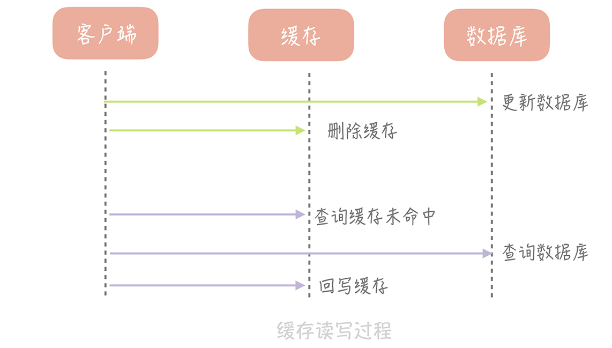
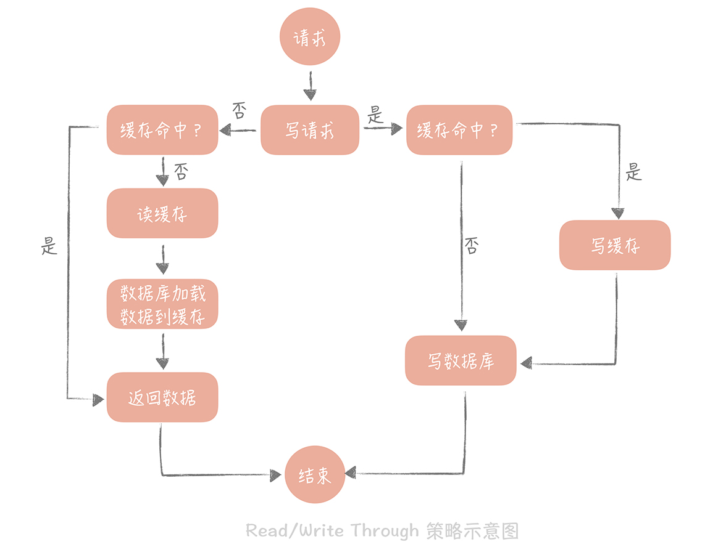
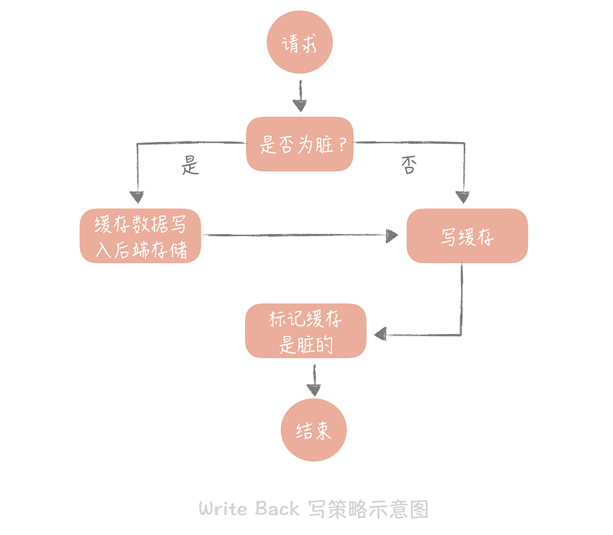
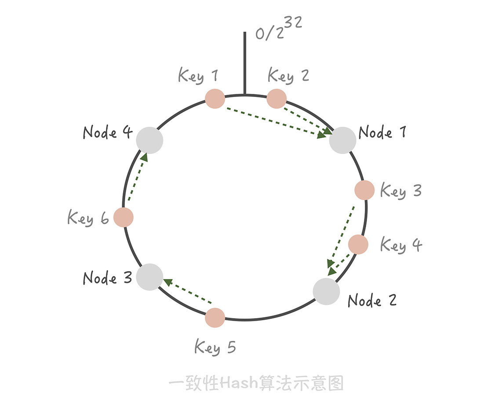
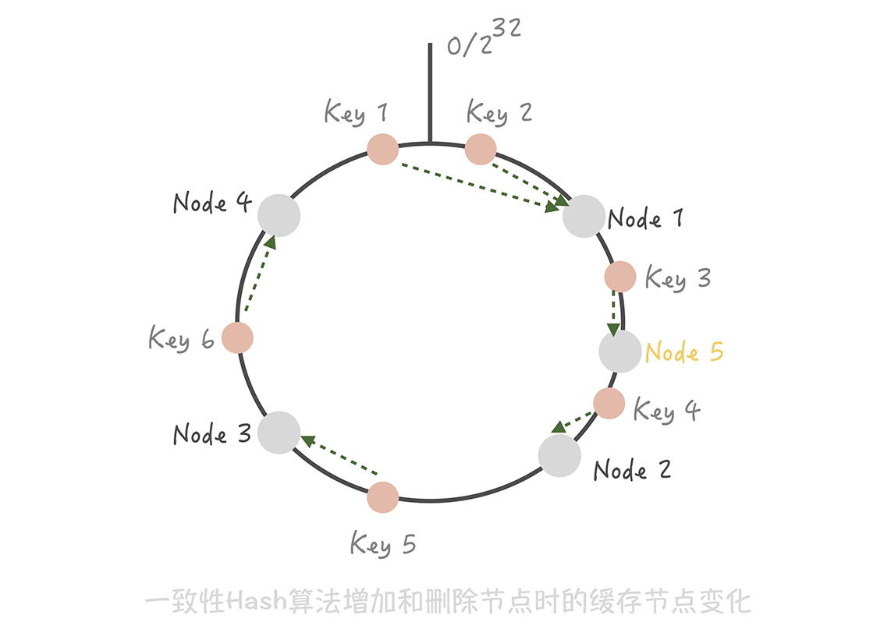
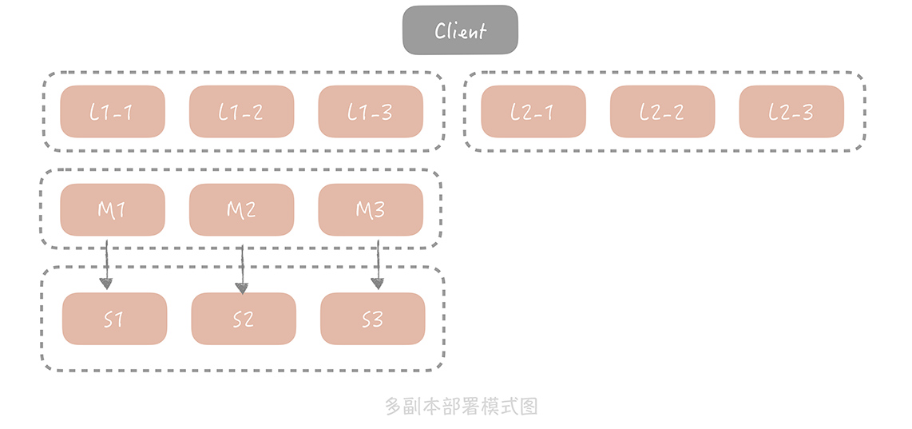
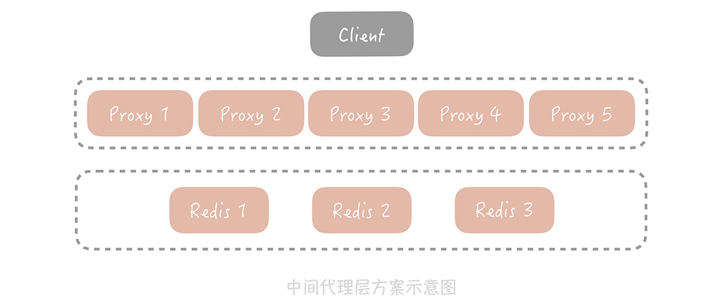
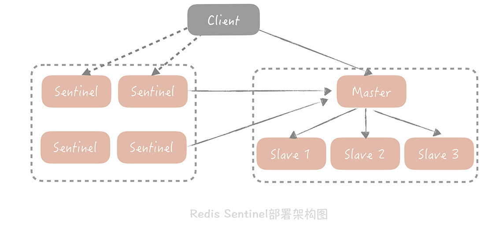

# 缓存

- 是什么

  - 凡是位于速度相差较大的两种硬件之间，用于协调两者数据传输速度差异的结构，均可称之为缓存
  - 可以提高低速设备的访问速度，或者减少复杂耗时的计算带来的性能问题

  > 缓冲区是什么： 用以弥补高速设备和低速设备通信时的速度差

- 常见分类

  - 静态缓存

    > 静态页面等，适用于静态数据

  - 分布式缓存

    > 主要针对动态数据，常见实现如 Memcached、Redis ，性能强劲，通过一些分布式的方案组成集群可以突破单机的限制

  - 本地缓存

    > 应用中的缓存，用于阻挡极端的热点数据查询对于分布式缓存节点或者数据库的压力

    > 数据更新相比分布式缓存复杂，一般使用场景是配置较短的过期时间，以避免返回脏数据

- 不足

  - 不适合写多场景

    缓存比较适合于读多写少的业务场景，并且数据最好带有一定的热点属性

    需要考虑**缓存命中率**

  - 给整体系统带来复杂度，存在数据不一致的风险

    可能存在脏数据的情况，需要考虑使用较短的过期时间或者手动清理的方式来解决

  - 带来运维成本

- 读写策略

  - Cache Aside（旁路缓存）策略

    

    以数据库中的数据为准，缓存中的数据是按需加载的

    - 步骤

      - 读策略
        从缓存中读取数据；
        如果缓存命中，则直接返回数据；
        如果缓存不命中，则从数据库中查询数据；
        查询到数据后，将数据写入到缓存中，并且返回给用户。

      - 写策略
        更新数据库中的记录；
        删除缓存记录。

    - 问题

      - 缓存中不存在的数据，两线程出现一读一写，可能会出现数据不一致

      - 写入比较频繁时，缓存中的数据会被频繁地清理

        - 更新缓存前先加一个分布式锁
          同一时间只允许一个线程更新缓存，但对于写入的性能会有一些影响

        - 更新数据时更新缓存，只是给缓存加一个较短的过期时间
          即使出现缓存不一致的情况，缓存的数据也会很快地过期，对业务的影响也是可以接受

  - Read/Write Through（读穿 / 写穿）策略

    

    用户只与缓存打交道，由缓存和数据库通信，写入或者读取数据

    - Write Through

      我们在使用本地缓存的时候可以考虑使用这种策略，比如说在上一节中提到的本地缓存 Guava Cache 中的 Loading Cache 就有 Read Through 策略的影子

      - Write Miss处置

        先查询要写入的数据在缓存中是否已经存在，如果已经存在，则更新缓存中的数据，并且由缓存组件同步更新到数据库中，如果缓存中数据不存在，我们把这种情况叫做“Write Miss（写失效）”。

        - Write Allocate（按写分配）
          写入缓存相应位置，再由缓存组件同步更新到数据库中

        - No-write allocate（不按写分配）
          不写入缓存中，而是直接更新到数据库中

    - Read Through
      先查询缓存中数据是否存在，如果存在则直接返回，如果不存在，则由缓存组件负责从数据库中同步加载数据。

    - 问题
      - 写数据库是同步的，影响性能
        异步更新 即writeBack策略

  - Write Back（写回）策略

    

    在写入数据时只写入缓存，并且把缓存块儿标记为“脏”的。而脏块儿只有被再次使用时才会将其中的数据写入到后端存储中
    无论是操作系统层面的 Page Cache，还是日志的异步刷盘，亦或是消息队列中消息的异步写入磁盘，大多采用了这种策略。因为这个策略在性能上的优势毋庸置疑，它避免了直接写磁盘造成的随机写问题，毕竟写内存和写磁盘的随机 I/O 的延迟相差了几个数量级呢。

    - 步骤

      - 读策略
        在读取缓存时如果发现缓存命中则直接返回缓存数据。如果缓存不命中则寻找一个可用的缓存块儿，如果这个缓存块儿是“脏”的，就把缓存块儿中之前的数据写入到后端存储中，并且从后端存储加载数据到缓存块儿，如果不是脏的，则由缓存组件将后端存储中的数据加载到缓存中，最后我们将缓存设置为不是脏的，返回数据就好了。

      - 写策略
        直接写缓存

- 高可用方案

  - 客户端方案

    在客户端配置多个缓存的节点，通过缓存写入和读取算法策略来实现分布式，从而提高缓存的可用性

    - 数据分片

      单一的缓存节点受到机器内存、网卡带宽和单节点请求量的限制，不能承担比较高的并发，因此我们考虑将数据分片，依照分片算法将数据打散到多个不同的节点上，每个节点上存储部分数据。
      这样在某个节点故障的情况下，其他节点也可以提供服务，保证了一定的可用性。

      - 方案

        - Hash 分片

          对缓存的 Key 做哈希计算，然后对总的缓存节点个数取余

          - 优势——简单易理解

          - 缺点——增加或者减少缓存节点时，缓存总的节点个数变化造成计算出来的节点发生变化，从而造成缓存失效不可用

        - 一致性 Hash 分片

          

          将整个 Hash 值空间组织成一个虚拟的圆环，然后将缓存节点的 IP 地址或者主机名做 Hash 取值后，放置在这个圆环上
          操作： 先对这个 Key 做同样的 Hash 取值，确定在环上的位置，然后按照顺时针方向在环上“行走”，遇到的第一个缓存节点就是要访问的节点。

          - 扩容过程
            在增加和删除节点时，只有少量的 Key 会“漂移”到其它节点上，而大部分的 Key 命中的节点还是会保持不变，从而可以保证命中率不会大幅下降

          - 问题即解决方案

            - 缓存节点在圆环上分布不平均，会造成部分缓存节点的压力较大；节点故障时，这个节点所要承担的所有访问都会被顺移到另一个节点上，会对后面这个节点造成压力
              - 引入虚拟节点
                将一个缓存节点计算多个 Hash 值分散到圆环的不同位置，这样既实现了数据的平均，而且当某一个节点故障或者退出的时候，它原先承担的 Key 将以更加平均的方式分配到其他节点上，从而避免雪崩的发生

            - 一致性 Hash 算法的脏数据问题

              发生漂移时，可能会读到其他节点的数据

              - 设置缓存的过期时间

      - 优势
        - 缓解缓存节点的存储和访问压力

      - 不足
        - 让缓存的使用更加复杂

    - 多副本读

      - 主写从读

      - 副本层读
        当客户端发起查询请求时，请求首先会先从多个副本组中选取一个副本组发起查询，如果查询失败，就继续查询 Master/Slave，并且将查询的结果回种到所有副本组中，避免副本组中脏数据的存在。
        只存储了更加热的数据，减少Master/Slave的请求量

  - 中间代理层方案

    

    在应用代码和缓存节点之间增加代理层，客户端所有的写入和读取的请求都通过代理层，而代理层中会内置高可用策略，帮助提升缓存系统的高可用。
    相当于把客户端方案的逻辑，无状态的、语言无关的移植到了Proxy层
    同时也能做到跨语言，逻辑复用

    - 实践

      - Codis

      - Mcrouter

      - Twemproxy

    - 优势
      - 屏蔽复杂逻辑，应用无需关心

    - 劣势
      - 有一定性能消耗

  - 服务端方案
    中间件提供的能力，如Redis Sentinel ，可以在主节点挂了以后自动将从节点提升为主节点，保证整体集群的可用性

- 问题场景

  核心目标在于减少对于数据库的并发请求

  - 缓存穿透

    缓存穿透其实是指从缓存中没有查到数据，而不得不从后端系统（比如数据库）中查询的情况。少量的缓存穿透不可避免，对系统也是没有损害的

    - 原因

      - 缓存系统容量有限的，不可能存储系统所有的数据

      - 根据2/8原则，经常访问热点数据只占20%，另有80%

    - 解决方案

      - 回种空值

      - 布隆过滤器

        - 缺陷

          - 只能判断 「可能存在」

          - 不支持删除元素。

  - 缓存击穿

    - 原因
      - 热点的缓存项，一旦失效会有大量请求穿透到数据库

    - 解决方案

      尽量地减少缓存穿透后的并发

      - 失效之后启动一个后台线程，穿透到数据库，将数据加载到缓存中，在缓存未加载之前，所有访问这个缓存的请求都不再穿透而直接返回。

      - 设置分布式锁，获取到锁的请求才能够穿透到数据库获取数据

  - 缓存雪崩

    - 原因
      - 大量热点缓存统一时间过期
    - 解决方案
      - 热点缓存的过期时间加一定的随机值
      - 多多多读少少少写的缓存考虑不设置过期时间

  - 热点key

    - 原因
      - 分区不均衡下，某分区下的key访问量超过了自己所能承受的负载范围
    - 解决方案
      - 缓存再降级，如使用本地缓存读写
      - 通过一定手段（日志等）提前预知热点Key并特殊处理

  - 大key

    - 原因
      - 某个key存储的内容过大，造成读写缓慢
    - 解决方案
      - 根据业务情况拆分key
      - 通过bigkey命令扫描出大key等做预警

## 思考
1. 多副本下副本层的添加 有点类似于CPU的L1/L2/L3 Cache
    用读取更快的设施来提升整体的响应速度，但一样会引入更高的复杂度，以及带来的数据一致性问题

2. 缓存雪崩的场景？

   个人感觉如果使用Cache Aside的场景下，要能出现大量雪崩的情况还是比较少见的，保守起见是可以把同一时间写入的缓存的过期时间做一定的随机数处理

3. 热点Key的处理方案

   京东有一个开源的项目[hotkey](https://gitee.com/jd-platform-opensource/hotkey),实现思路的[文章](https://mp.weixin.qq.com/s/xOzEj5HtCeh_ezHDPHw6Jw)里给了很多思路和框架的设计思想

   大方向还是多级缓存，但是让更接近业务层的缓存的命中率更高（通过探测预热刷入实现）

## 参考资料

* 极客时间-高并发系统设计 40 问 