# Kafka

1. 系统架构

   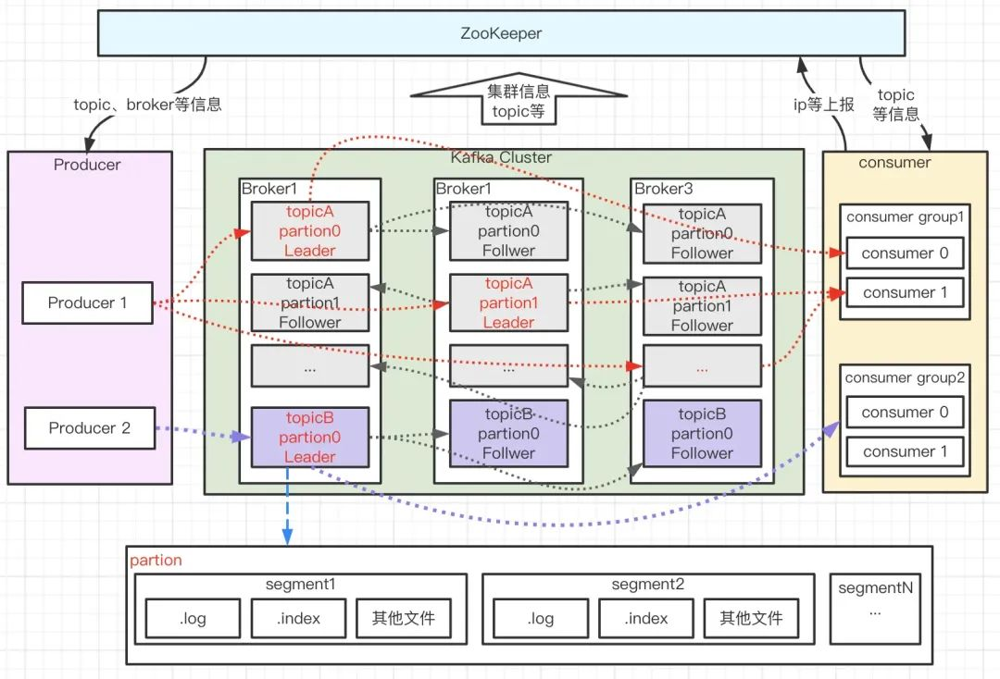

   Kafka 由 Producer、Broker、Consumer 以及负责集群管理的 ZooKeeper 组成

2. 基础概念

   * Producer

     生产者，负责消息的创建并通过一定的路由策略发送消息到合适的 Broker

   * Broker

     服务实例，负责消息的持久化、中转等功能

   * Consumer 

     消费者，负责从 Broker 中拉取（Pull）订阅的消息并进行消费，通常多个消费者构成一个分组，消息只能被同组中的一个消费者消费

   * ZooKeeper

     负责 broker、consumer 集群元数据的管理等；（注意：Producer 端直接连接 broker，不在 zk 上存任何数据，只是通过 ZK 监听 broker 和 topic 等信息）

   * topic

     消息主题。Kafka 按 topic 对消息进行分类，我们在收发消息时只需指定 topic。

   * partition

     分区，为了提升系统的吞吐

     > 一个 topic 下通常有多个 partition，partition 分布在不同的 Broker 上，用于存储 topic 的消息，这使 Kafka 可以在多台机器上处理、存储消息，给 Kafka 提供给了并行的消息处理能力和横向扩容能力。另外，为了提升系统的可靠性，partition 通常会分组，且每组有一个主 partition、多个副本 partition，且分布在不同的 broker 上，从而起到**容灾**的作用。

   * segment：分段

     > 一个 partition 对应一个日志（Log）。由于生产者生产的消息会不断**追加到 log 文件末尾**，为防止 log 文件过大导致数据检索效率低下，**Kafka 采取了分段和索引机制，将每个 partition 分为多个 segment，同时也便于消息的维护和清理**。每个 segment 包含一个.log 日志文件、两个索引(.index、timeindex)文件以及其他可能的文件。每个 Segment 的数据文件以该段中最小的 offset 为文件名，当查找 offset 的 Message 的时候，通过二分查找快找到 Message 所处于的 Segment 中。

   * offset

     消息在日志中的位置

     > 消息在被追加到分区日志文件的时候都会分配一个特定的偏移量。offset 是消息在分区中的唯一标识，是一个单调递增且不变的值。Kafka 通过它来保证消息在分区内的顺序性，不过 offset 并不跨越分区，也就是说，**Kafka 保证的是分区有序而不是主题有序**。

3. 数据存储

   * 存储日志的.log 文件

   * 位移索引文件.index

     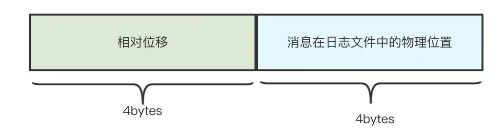

     * 相对位移

       保存于索引文件名字上面的起始位移的差值

       > 离当前起始位移的差值

     * 文件物理位置

       消息在 log 文件中保存的位置

       > 消息位移-> 消息所在的物理位置->从log文件中找到对应的消息

       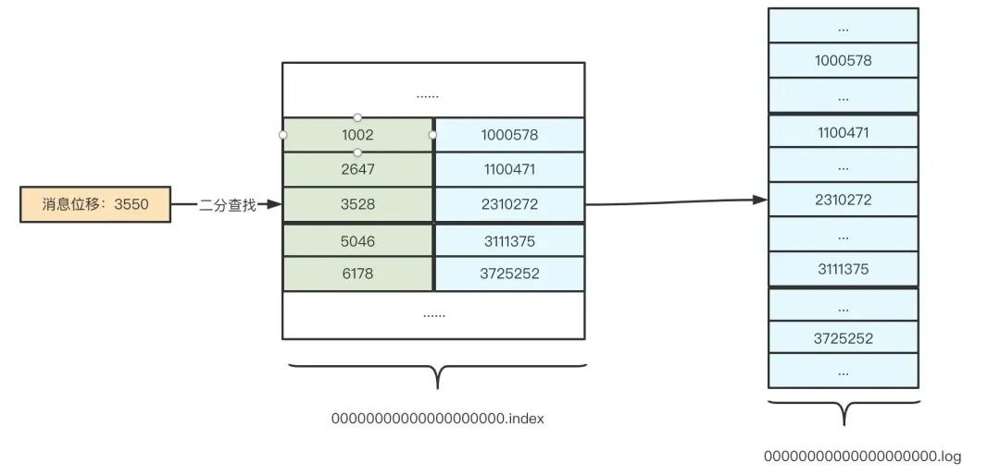

   * 时间戳索引文件.timeindex

     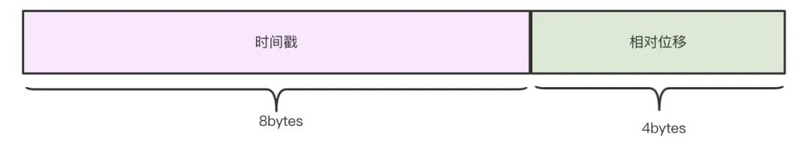

     > 0.10.0.0版本后支持，满足用户需要根据时间戳查询消息记录

     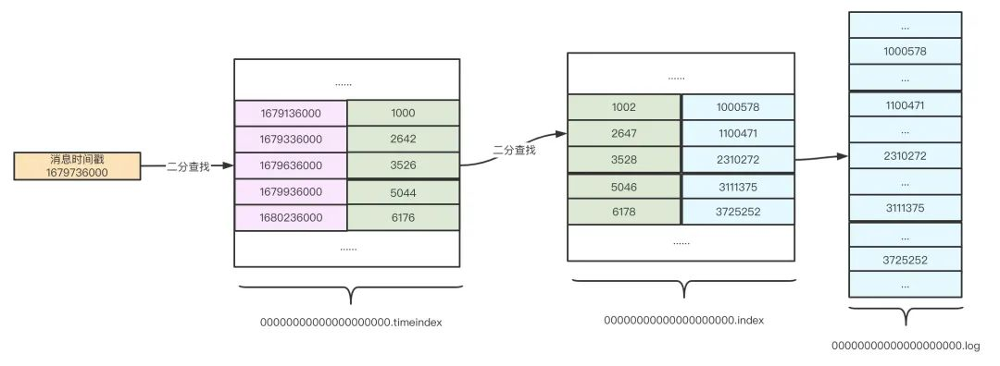

4. 负载均衡

   1. 生产者负载均衡

      指如何将消息发送到合适的分区，由分区器实现

      默认的分区器 DefaultPartitioner策略

      * 指定key情况下

        对 key 值进行 Hash 计算，从所有分区中根据  Hash 值计算得到分区号；拥有相同 Key 值的消息被写入同一个分区

        > 消息局部有序，顺序消息实现的关键

      * 不指定key情况下

        以轮询的方式，在所有可用分区中分别写入消息

      可自实现分区器

   2. 消费者负载均衡

      每个分区（Partition）只能由一个消费者组中的一个消费者消费

      当消费者组中有多个消费者时，Kafka 会自动进行负载均衡，将分区均匀地分配给每个消费者

      可以通过设置 partition.assignment.strategy配置分区分配策略

      * range

        在保证均衡的前提下，将连续的分区分配给消费者

      * round-robin

        在保证均衡的前提下，轮询分配

      * StickyAssignor

        保证分区均衡的前提下尽量保持原有的分区分配结果，从而避免许多冗余的分区分配操作，减少分区再分配的执行时间

        > 0.11.0.0引入

5. 高可靠性的保证

   1. 消息传递过程及风险

      * 消息从生产者可靠地发送至 Broker

        1. 风险

           1. 网络不稳定性
           2. 本地丢数据

        2. 解决核心

           1. Producer 发送消息后，能够收到来自 Broker 的消息保存成功 ack；
           2. Producer 发送消息后，能够捕获超时、失败 ack 等异常 ack 并做处理。

        3. 解决方案

           1. ack 策略

              > Kafka 为我们提供了三种 ack 策略

              1. Request.required.acks = 0：请求发送即认为成功，不关心有没有写成功，常用于日志进行分析场景；
              2. Request.required.acks = 1：当 leader partition 写入成功以后，才算写入成功，有丢数据的可能；
              3. Request.required.acks= -1：ISR 列表里面的所有副本都写完以后，这条消息才算写入成功，强可靠性保证；

           2. 消息发送策略

              > Kafka 提供两类消息发送方式

              1. async=0，同步（sync）发送，默认值

                 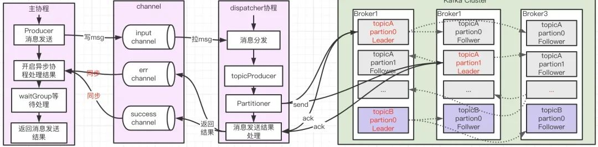

                 > 是在异步发送的基础上加以条件限制实现的。同步消息发送在 newSyncProducerFromAsyncProducer 中开启两个**异步协程**处理消息成功与失败的“回调”，并使用 waitGroup 进行等待，从而将异步操作转变为同步操作

              2. async=1，异步（async）发送

                 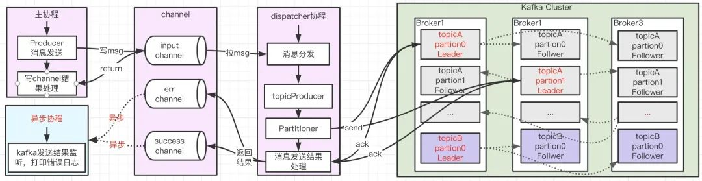

        4. 最佳实践

           1. 设置 Request.required.acks= -1

           2. 设置集群中处于正常同步状态的副本 follower 数量 min.insync.replicas>2

           3. 设置 unclean.leader.election.enable=false 使得集群中 ISR 的 follower 才可变成新的 leader

              >  避免特殊情况下消息截断的出现

           4. 使用同步发送代替异步发送，如果使用异步，需要通过channel捕捉消息失败的情况并做补偿处理，对于时延比较敏感的业务可以考虑用异步。

      * 发送到 Broker 的消息可靠持久化

        1. 风险
           *  Pagecache 缓存落盘（刷盘机制）
           * 单点崩溃（容灾机制）
           * 多副本间数据同步一致性问题

        2. 解决核心

           - Broker 返回 Producer 成功 ack 时，消息是否已经落盘；
           - Broker 宕机是否会导致数据丢失，容灾机制是什么；
           - Replica 副本机制带来的多副本间数据同步一致性问题如何解决；

        3. 解决方案

           1. 异步刷盘机制带来的风险性

              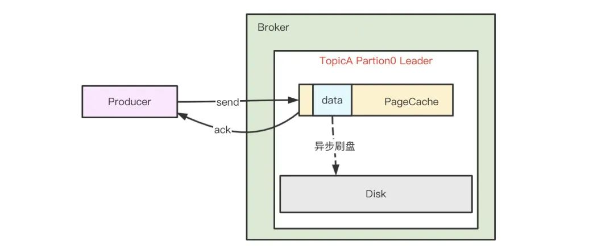

              Kafka**没有提供**同步刷盘的机制，Broker 接收到消息后只是将数据写入 PageCache 后便认为消息已写入成功， PageCache的刷盘机制由系统决定，因此单机场景存在消息丢失的风险，**该问题无法从修改刷盘机制配置实现**

           2. Replica 多副本机制

              Kafka 中，复制的基本单位是分区，同组分区的不同副本分布在不同的 Broker 上，保存相同的消息(可能有滞后)

              副本之间是“一主多从”的关系，其中 leader 副本负责处理读写请求，follower 副本负责从 leader 拉取消息进行同步

              消息在写入到主节点之后，并不会马上返回写入成功，而是等待足够多的节点(设置的ISR数量)都复制成功后再返回

              * 概念
           
                *  AR（Assigned Replicas） 所有副本
                *  ISR（In-Sync Replicas） 与 leader 副本保持一定同步的副本(ISR包括主节点)
                *  OSR（Out-of-Sync Replicas）与 leader 同步滞后过多的副本

                > AR=ISR+OSR

              * 运作过程

                * 数据同步

                  * follower 默认每隔 500ms 向 leader fetch 一次数据

                  * 只要一个 Follower 副本落后 Leader 副本的时间不连续超过 10 秒，就认为该 Follower 副本与 leader 是同步的

                    取决于 Broker 端参数 replica.lag.time.max.ms(默认为 10 秒)

                  > 最佳实践下，所有的 follower 副本都应该与 leader 副本保持一定程度的同步，即 AR=ISR，OSR 集合为空

                * 故障转移

                  * 借助 ZK 从 follower 副本中选举新的 leader 

                  * 默认情况下只有在 ISR 集合中的副本才有资格被选举为新的 leader

                    > 为了保证使选举的新 leader 和旧 leader 数据尽可能一致

                    > 可通过修改unclean.leader.election.enable配置来决定OSR集合是否有机会选举 

           3. 多副本间数据同步一致性

              * 高水位更新机制

                1. 概念

                   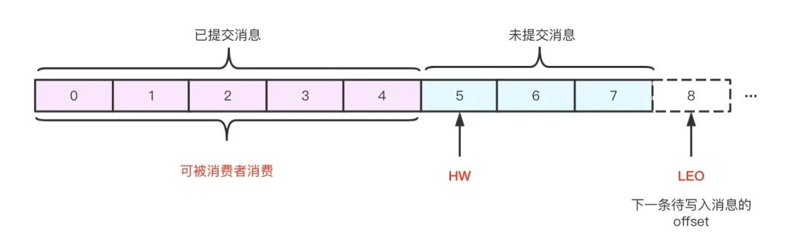

                   * **HW**:

                     High Watermark，高水位，表示已经提交(commit)的最大日志偏移量，Kafka 中某条日志“已提交”的意思是 ISR 中所有节点都包含了此条日志，并且消费者只能消费 HW 之前的数据；

                     * Leader HW

                       = min（所有副本 LEO）

                       >  Leader 副本不仅要保存自己的 HW 和 LEO，还要保存 follower 副本的 HW 和 LEO

                     * Follower HW

                       = min(follower 自身 LEO，leader HW)

                   * **LEO**

                      Log End Offset，表示当前 log 文件中下一条待写入消息的 offset；
           
                   > 所有副本都有对应的 HW 和 LEO
                   >
                   > Kafka 使用 Leader 副本的高水位来定义所在分区的高水位，即分区的高水位就是其 Leader 副本的高水位

                2. 更新过程

                   > 下面Leader HW简记为HWL，Follower HW简记为HWF，Leader LEO简记为LEOL ，Follower LEO简记为LEOF

                   * 初始状态

                     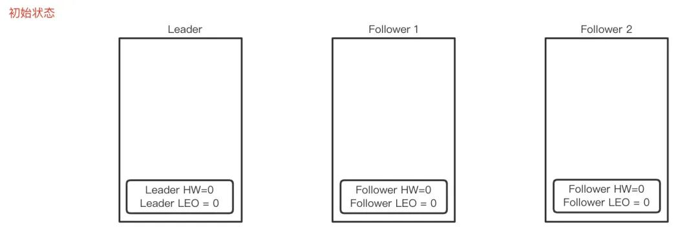

                     HWL=0，LEOL=0，HWF=0，LEOF=0

                   * 第一次fetch

                     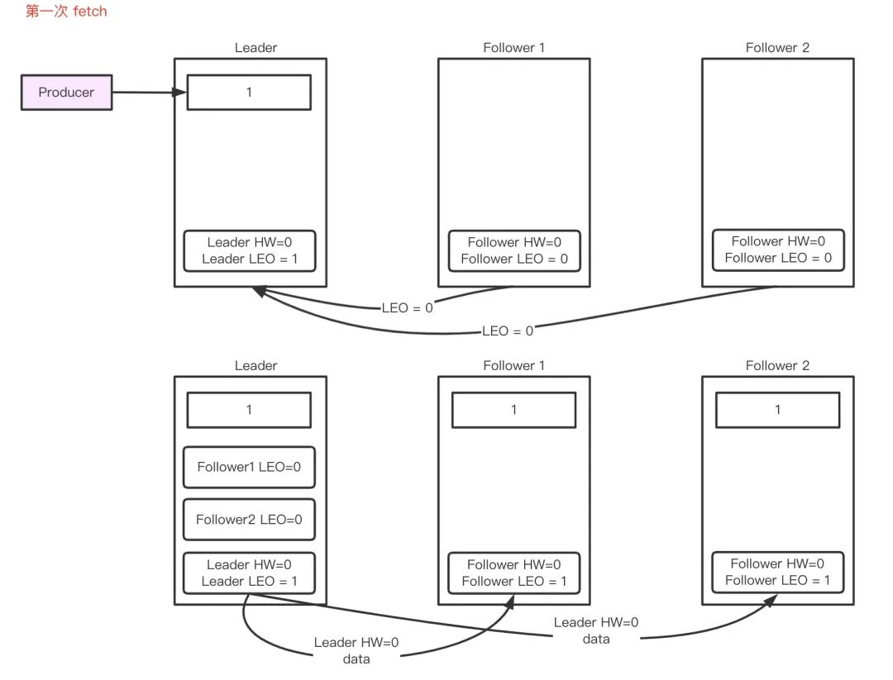
           
                     * Leader 收到Producer发来的一条消息完成存储, 更新LEOL=1;
                     * Follower从Leader fetch数据,  Leader收到请求，记录follower的LEOF =0，并且尝试更新HWL =min(全部副本LEO)=0；
                     * Leader返回HWL=0和LEOL=1给Follower，Follower存储消息并更新LEOF =1, HWF=min(LEOF，HWL)=0。

                   * 第二次 fetch

                     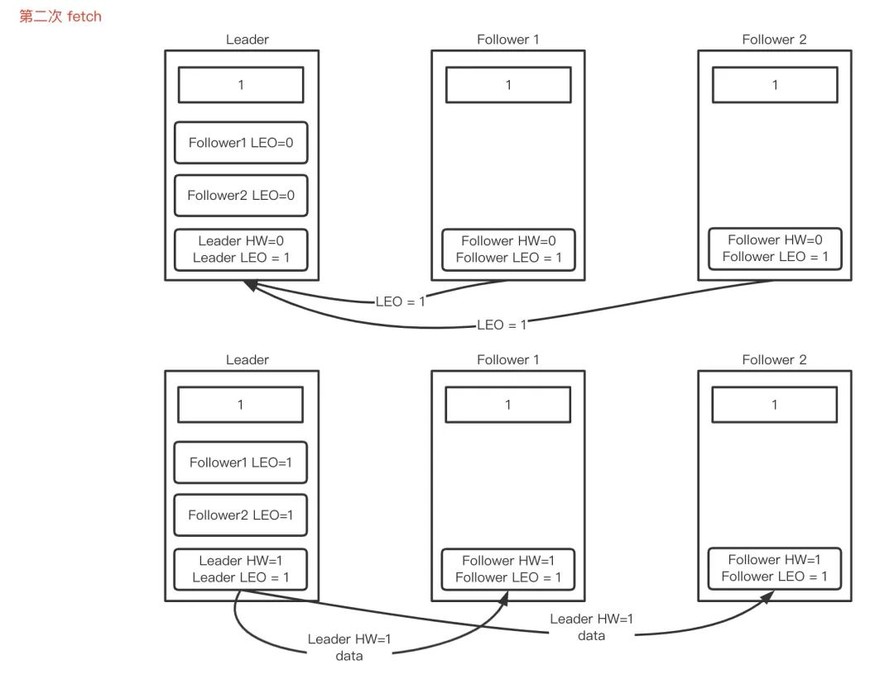
           
                     * Follower再次从Leader fetch数据,  Leader收到请求，记录follower的LEOF =1，并且尝试更新HWL =min(全部副本LEO)=1；
                     * Leader返回HWL=1和LEOL=1给Follower，Follower收到请求，更新自己的 HWF=min(LEOF，HWL)=1。

                3. 存在的问题

                   > 如果 Leader 节点更新期间发生故障，则 Follower 的 HW 和 Leader 的 HW 可能会处于不一致状态

                   * 数据丢失

                     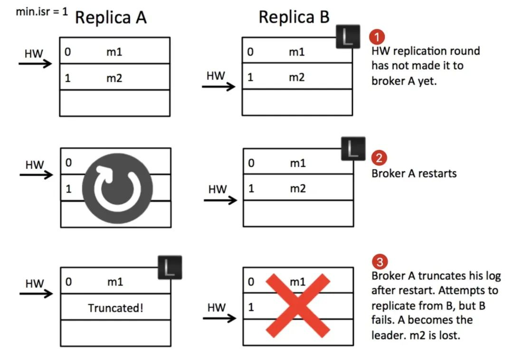

                   * 数据错乱

                     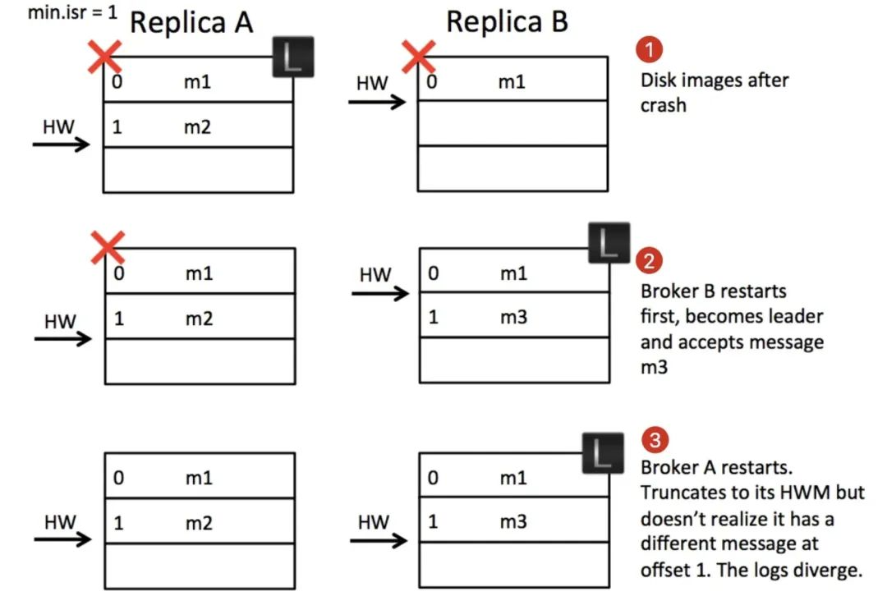

                4. 解决方案

                   1. Leader Epoch

                      > Kafka 引入了 Leader Epoch 的概念。leader epoch 和 raft 中的任期号的概念很类似，每次重新选择 leader 的时候，用一个严格单调递增的 id 来标志，可以让所有 follower 意识到 leader 的变化。

                      > Follower 也不再以 HW 为准，每次奔溃重启后都需要去 leader 那边确认下当前 leader 的日志是从哪个 offset 开始的

                      * 数据丢失

                        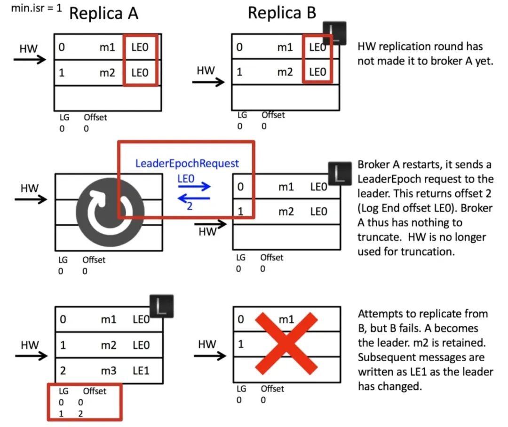

                      * 数据错乱
           
                        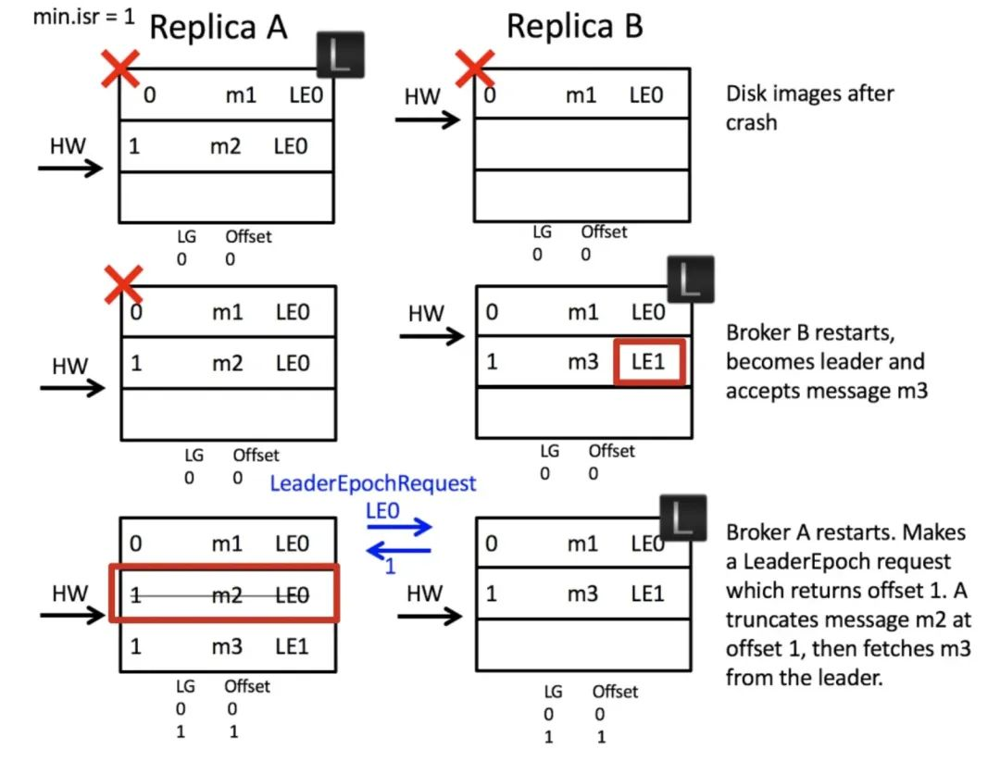

      * 消费者从 Broker 消费到消息且最好只消费一次

        > 风险：跨网络消息传输的可靠性

        通常是通过手动提交+幂等实现消息的可靠消费

        1. 自动提交和手动提交

           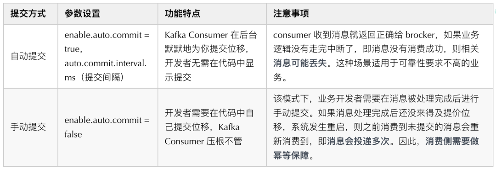

   2. 精确一次（exactly once）的实现

      幂等性（Idempotence）和事务（Transaction）

      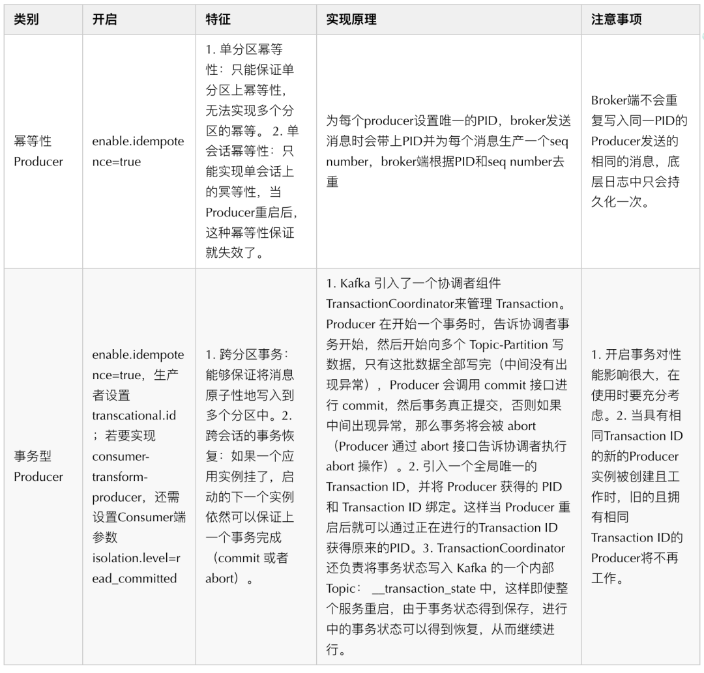

   > Kafka 的Exactly Once和我们通常理解的消息队列的服务水平中的 Exactly Once 是不一样的
   >
   > 通常理解： 消息从生产者发送到 Broker，然后消费者再从 Broker 拉取消息，然后进行消费。这个过程中，确保每一条消息恰好传输一次，不重不丢
   >
   > Kafka 的 Exactly Once： 在流计算中，用 Kafka 作为数据源，并且将计算结果保存到 Kafka 这种场景下，数据从 Kafka 的某个主题中消费，在计算集群中计算，再把计算结果保存在 Kafka 的其他主题中。这样的过程中，保证每条消息都被恰好计算一次，确保计算结果正确。
   >
   > 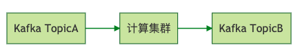 

6. 高性能的设计

   * 异步发送

     同步发送本质上也是异步的，但是在处理结果时，同步发送通过 waitGroup 将异步操作转换为同步，以最大化提高消息发送的吞吐能力

   * 批量发送

     多个消息打包成一个批次进行发送，无论是同步发送还是异步发送，都是先把消息在内存中缓存起来，选择合适的时间把消息组成一批一并发送

     减少网络传输的开销，提高网络传输的效率和吞吐量

     处理消息时也是以一条`批处理`消息为单位做处理

     * batch.size

       控制批量发送消息的大小，默认值为 16KB

       > 如果批量发送的大小设置得过大，可能会导致消息发送的延迟增加，因此需要根据实际情况进行调整

     * linger.ms

       控制消息在批量发送前的等待时间，默认值为 0

       大于0时，会等待指定时间或达到batch.size大小后发送

   * 压缩技术

     传输前压缩信息，到达后解压信息，从而减少网络传输的开销

     >压缩和解压缩的过程会消耗一定的 CPU 资源

     * 压缩算法

       * GZIP

       * Snappy

       * LZ4

       * Zstandard（2.10版本后支持）

         > Facebook 开源，能够提供超高压缩比

       > 吞吐量：LZ4>Snappy>zstd 和 GZIP，压缩比：zstd>LZ4>GZIP>Snappy

     * 参数配置

       * compression.type

         控制压缩算法的类型，默认值为 none，表示不进行压缩

       * compression.level

         控制压缩的级别，取值范围为 0-9，默认值为-1。当值为-1 时，表示使用默认的压缩级别

     * 压缩传输过程

       * 选择一批消息一起压缩，每一个批消息就是一个压缩分段

       * 生产者生成一个批消息发给服务端

         > 服务端也不用对这批消息进行解压，可以整批直接存储，然后整批发送给消费者
         >
         > 不消耗服务端CPU资源，且获得压缩多余空间和传输时间的优势

       * 消费者接收批消息，并解压消息

         > 消息解压的动作交给了消费者

   * Pagecache 机制&顺序追加落盘

     * Broker 接收到消息后只是将数据写入PageCache后便认为消息已写入成功，PageCache进行异步刷盘

       > 提高读写效率但是也增加了丢失数据的风险性

       读写消息文件的时候，也充分利用了 PageCache 的特性，对于刚刚写入PageCache的消息，在读取命中时命中率较高

     * 数据顺序追加写到磁盘日志文件中

       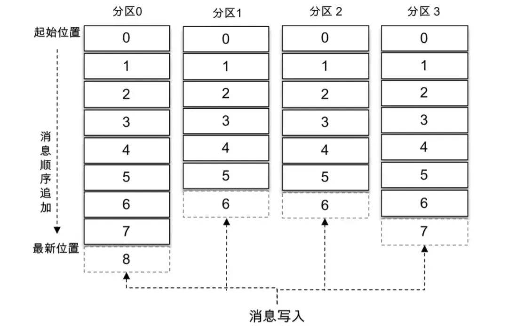

       > 利用顺序IO替代随机IO

   * [零拷贝](../3-操作系统/零拷贝.md)

     * Kafka使用mmap来处理其索引文件

       > 索引文件用于在提取日志文件中的消息时进行高效查找

     * 在 Consumer 从 Broker 读数据过程中使用了 sendfile 技术

       > 通过 NIO 的 `transferTo/transferFrom` 

   * 稀疏索引

     不会为每个记录都保存索引，而是写入一定的记录之后才会增加一个索引值

     > 时间间隔通过log.index.interval.bytes 参数进行控制，默认大小为 4 KB

     > 索引文件是按照消息的顺序性进行增加索引项的，因此 Kafka 可以利用二分查找算法来搜索目标索引项

   * broker & 数据分区

     一个topic多partition->不同partition分布在不同broker

     提供了 并行的消息处理能力 和 横向扩容能力

   * 多 reactor 多线程网络模型

     Broker 端处理消息时采用了多 reactor 多线程模型

     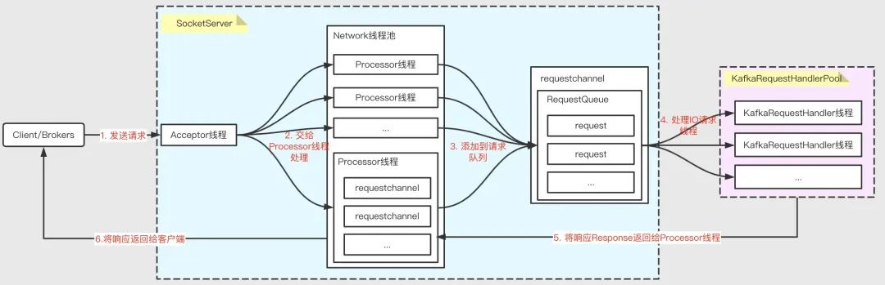

     * 组件

       * SocketServer

         实现 Reactor 模式，用于处理多个 Client（包括客户端和其他 broker 节点）的并发请求，并将处理结果返回给 Client

       * KafkaRequestHandlerPool

         Reactor 模式中的 Worker 线程池，里面定义了多个工作线程，用于处理实际的 I/O 请求逻辑。

     * 步骤

       1. Acceptor 接收客户端发来的请求
       2. 轮询分发给 Processor 线程处理
       3. Processor 将请求封装成 Request 对象，放到 RequestQueue 队列
       4. KafkaRequestHandlerPool 分配工作线程，处理 RequestQueue 中的请求
       5. KafkaRequestHandler 线程处理完请求后，将响应 Response 返回给 Processor 线程
       6. Processor 线程将响应返回给客户端

## 参考资料

* [Kafka 高可靠高性能原理探究](https://mp.weixin.qq.com/s/_g11mmmQse6KrkUE8x4abQ)
* 极客时间-消息队列高手课