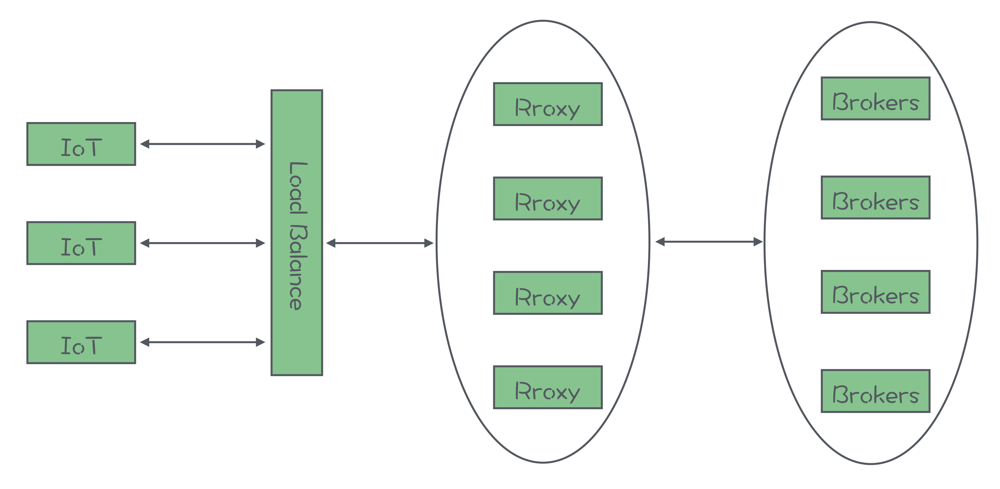
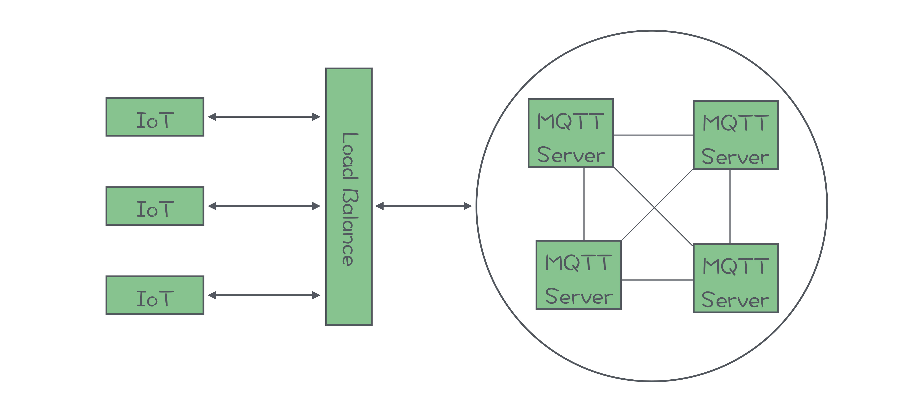

# MQTT

1. 是什么
   * 为物联网设备设计的一套标准的消息队列通信协议
   * 构建于TCP/IP协议上
   * 低开销、低带宽占用的即时通讯协议

2. 特点

   * 应用场景决定需要支撑海量的客户端和主题

3. 与其它协议的不同

   > 由于使用场景产生的不同， IoT 设备成本较低，可能都没有 CPU，也不一定有操作系统，所以协议不能太复杂，报文不能太大，功能不能太多

   * 协议报文精简

   * 只有发布订阅主题和收发消息这两个最核心的功能

   * 加入会话机制，服务端保存会话

     > 使客户端实现更加简单

   * 不支持点对点通信，每个客户端都创建一个以自己 ID 为名字的主题，然后客户端订阅自己的专属主题，用于接收专门发给这个客户端的消息

     > 主题的数量是和客户端的数量基本是同一个量级的

4. 产品选型

   1. 传统消息队列扩展

      > 通过扩展原有消息队列，使其支持MQTT

      * 缺点

        * 元数据存储不支持存储大量主题和客户端

          > 如RocketMQ的NameServer,Kafka的Zookeeper等

   2. 专门的MQTT Server产品

      * 缺点
        * 开源的MQTT Server没有集群的功能

5. 设计

   1. 如何支撑海量连接设备

      * 架构

        * 通过LB+proxy

          

          域名解析的LB，LB负载转发请求到Proxy

          Proxy维护客户端会话，进行Broker的消息转发

        * 通过LB

          

          Proxy和Broker的合并版(合并到一个进程中)

      * 思路

        * Proxy水平可扩展，可根据IoT设备的数量动态扩缩容

        * Proxy与Broker只需要一个连接通信

          > 这样可以保证Broker的连接数不会过多

        * Proxy维护客户端会话

          * 将会话保存在 Proxy 本地

            每个 Proxy 节点都只维护连接到自己的这些客户端的会话

            > 需要负载均衡保证会话都发往同一个Proxy，即支持sticky session，但存在部分热点的风险

          * 将会话保存在一个外置的存储集群中

            如Redis集群，Proxy可完全无状态

            > 但要求外置存储集群具备存储千万级数据的能力

        * 部署多组Broker小集群

          每个小集群只负责存储一部分主题

          > 可以在 Proxy 中采用一些像一致性哈希等分片算法，根据主题名称找到对应的 Broker 小集群