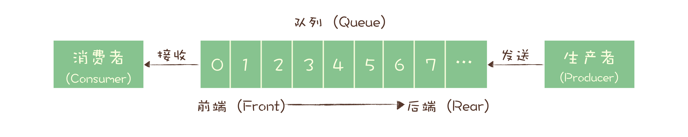
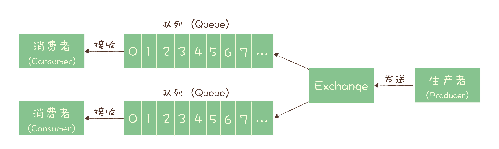

# 基础理论

1. 是什么

   1. 是一个短暂存储数据的队列

2. 作用

   1. 异步解耦

      同步调用转换成异步消息通知

   2. 削峰填谷

      利用 broker 缓冲上游生产者瞬时突发的流量，将消息进行堆积后短暂延迟处理，使消费者消费流量整体平滑

      > 也可用于流量控制

   3. 服务解耦

      解决系统耦合过于紧密的问题，下游服务的增加减少不影响上游服务

   4. 作为发布 / 订阅系统实现一个微服务级系统间的观察者模式；

   5. 连接流计算任务和数据；

   6. 用于将消息广播给大量接收者

3. 消息模型

   1. 队列模型

      

      * 消费者之间是竞争关系

        > 一条消息只能被一个消费者消费到

      * 消息有序消费

   2. 发布-订阅模型

      

      * 发送方称为发布者（Publisher）
      * 接收方称为订阅者（Subscriber）
      * 存放消息的容器称为主题（Topic）
      * 订阅者都可以接收到主题的所有消息

      > 发布 - 订阅模型在功能层面上是可以兼容队列模型的

   3. RabbitMQ消息模型

      

      * Exchange 位于生产者和队列之间
      * 生产者消息发送给 Exchange
      * Exchange 上配置的策略来决定将消息投递到哪些队列中

   4. RocketMQ消息模型

      

      * 每个主题包含多个队列，通过多个队列来实现多实例并行生产和消费

      * 通过消费组（Consumer Group）实现订阅者的概念

        > 同一个组内的消费者是竞争消费的关系，每个消费者负责消费组内的一部分消息，不同消费组之间消费进度彼此不受影响

      * 每个消费组在每个队列上维护一个消费位置（Consumer Offset）

        > 丢消息的原因大多是由于消费位置处理不当导致的

   5. Kafka消费模型

      * 基本概念与RocketMQ一致
      * RocketMQ队列的概念在Kafka中对应的是分区（Partition）

4. 常见产品

   1. RabbitMQ

      > 兔子MQ，Erlang 语言编写，它最早是为电信行业系统之间的可靠通信设计的，少数几个支持 AMQP 协议的消息队列之一

      不足

      * 对消息堆积支持不够友好
      * 性能比起Kafka/RocketMQ较差
      * 编写语言较为冷门

   2. RocketMQ

      > 阿里内部MQ的开源版本，Java语言编写，各项能力较为均衡

      不足

      * 国际流行度一般
      * 周边生态一般

   3. Kafka

      > Linkedin开发，Scala和Java语言编写，大量使用了批量和异步的思想

      不足

      * 同步收发消息的时延较高

        > 异步批量的设计带来的问题
        >
        > 有很多攒一批再发送的设计思想
        >
        > 不太适合在线业务场景

   4. Pulsar

      > 新兴的开源消息队列产品，采用存储和计算分离的设计

   5. ActiveMQ

   6. ZeroMQ

5. 如何保证消息正确消费

   正确消费： 消息不丢失且只消费一次

   * 消息丢失的场景

     * 在消息生产的过程中丢失消息

       * 原因

         * 网络抖动
         * 生产者服务异常

       * 解决方案

         * 消息重传

           在未得到消息队列正确响应时，重传消息

           > 也不能无限制地重传消息，一般只需重传2-3次
           >
           > 但可能造成消息重复

     * 在消息队列中丢失消息

       * 原因

         * 消息未正确落盘

       * 解决方案

         * 消息正确落盘后再返回成功到生产者

           可能对性能有一定影响

         * 基于中间件特性部署集群服务

           如Kafka集群服务的ISR机制

     * 在消费的过程中丢失消息

       * 原因
         * 消息在未正确处理时就更新偏移量
       * 解决方案
         * 在消息消费的业务正常处理后，再向消息中间件提交偏移量

   * 消息重复的场景

     * 在消息生产的过程中重复

       * 原因

         * 因网络延迟重试等问题，多次发送同一条信息

       * 解决方案

         * 引入唯一标识标识同一条消息，进行去重

           >  如Kafka中引入了producer idempotency特性，每一个生产者一个唯一的 ID，并且为生产的每一条消息赋予一个唯一 ID，每条唯一ID的数据只存储一次

     * 在消费的过程重复消费

       * 原因

         * 消息消费后未能更新偏移量，导致消费者重复接收消息

           > 如消费者服务在消费过程中宕机等

       * 解决方案

         * 通过消息ID去重，已经处理过的消息ID不再处理

         * 业务层面保证幂等性，多次执行结果幂等

6. 消息延迟的处理

   1. 如何监控消息延迟

      * 监控消息队列自带的监控指标

        * 自有工具

          >  如Kafka的kafka-consumer-groups.sh,RocketMQ的mqadmin

        * JMX

      * 通过生成监控消息判断

        

        * 定时循环写入消息到消息队列中

          > 内容可以是时间戳

        * 业务程序消费时丢弃，监控程序获取消息生成时间做对比

        * 根据对比的差值情况判断是否达到告警阈值

   2. 如何减少消息延迟

      1. 消费端

         1. 优化消费代码提升性能

         2. 增加消费者的数量

            > 不能直接增加消费者，例如Kafka和RocketMQ都有分区/队列的概念，一个分区只能在一个消费组下只能有一个消费者消费，因此盲目增加消费者数量没有实际作用，但可通过增加分区来提升处理能力

            * 增加同一消费者的并行处理能力

              多线程处理消息，将单一消费者串行处理消息变为并行处理

      2. 服务端

         1. 消息的存储性能

            > 顺序写，利用Page Cache等

         2. [零拷贝](../3-操作系统/零拷贝.md)
      
            把磁盘中的数据通过网络发送给消费客户端的性能优化

## 参考资料

* [Kafka 高可靠高性能原理探究](https://mp.weixin.qq.com/s/_g11mmmQse6KrkUE8x4abQ)
* 极客时间-高并发系统设计 40 问 
* 极客时间-消息队列高手课