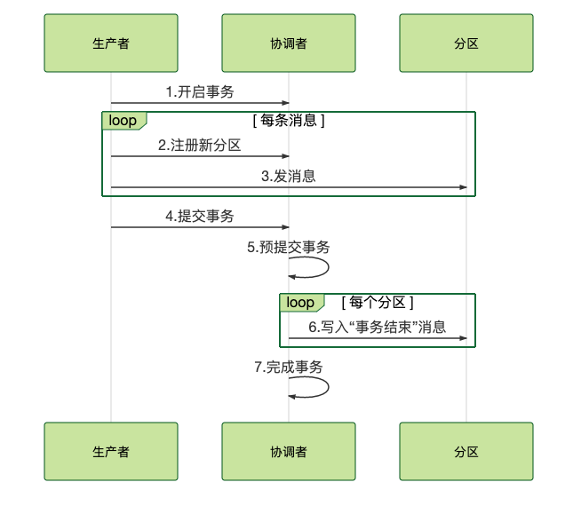

# 消息事务

1. 是什么

   * 通过一定手段，使消息生产者和消息消费者对某个业务保持事务操作

2. 为什么

   * 解决消息生产者和消息消费者的数据一致性问题

3. 适用场景

   * 异步更新数据，且需要保证某个业务的一致性
   * 对实时性要求不高的业务场景

4. 限制性

   * 无法实现严格的事务ACID特性

     > 同分布式事务一致，实现代价太大
     >
     > 对一致性只能出现残血版如顺序一致/因果一致/最终一致等

5. 如何实现

   > Kafka和RocketMQ都提供了事务相关功能
   >
   > 但语义不同
   >
   > Kafka: 确保多条消息在一个事务中，要么都发送成功，要么都发送失败，这里面的多条消息不一定要在同一个主题和分区中，可以是发往多个主题和分区的消息
   >
   > RocketMQ: 确保本地事务和消息，要么都成功，要么都失败
   >
   > 实现核心都是两阶段提交

   * RocketMQ

     > RocketMQ实际上实现是通过将未提交的事务消息保存到特殊队列中，当消息提交后才把消息放到实际的队列中

     

     1. 生产者向消息队列发送一个半消息

        > 半消息的含义: 在事务提交之前，对于消费者来说，这个消息是不可见的
        >
        > 此时消息存储在RMQ_SYS_TRANS_HALF_TOPIC的0号队列中

     2. 如果MQ返回成功，生产者执行本地事务

     3. 生产者根据本地事务执行的成功/失败，决定提交或是回滚事务消息

        > 如果提交，消息将会复制到正常的消息队列中
   
     4. 消息队列通过事务反查的机制定期向该消费者反查事务完成状态，决定是提交还是回滚消息
   
        > 这个情况仅在第三步有问题，即异常场景下触发，在正常情况下，生产者可直接向消息队列发送提交/回滚的指令
        >
        > 需要业务方实现这个反查本地事务的接口
        >
        >  Broker 的 TransactionalMessageCheckService 服务中启动了一个定时器，定时从半消息队列中读出所有待反查的半消息
   
   * Kafka
   
     
   
     1. 生产者发送一个请求开启事务，告知协调者消息的主题和分区，协调者在事务日志中记录下事务 ID
   
     2. 发送普通消息给消息队列
   
        > 此时Broker会正常存储消息，但是会在客户端过滤未提交的事务消息
   
     3. 向消息队列（实际为协调者）发送提交或回滚的请求
     
        > 由协调者来开始两阶段提交，完成事务。第一阶段，协调者把事务的状态设置为“预提交”，并写入事务日志。
        >
        > 第二阶段，协调者在事务相关的所有的Broker分区中，都会写一条“事务结束”的特殊消息
        >
        > 此时客户端在接到这个特殊消息后，将之前过滤的消息返回给业务消费
     
     4. 对于异常情况，仅能进行多次重试或抛出异常

## 参考资料

* 极客时间-消息队列高手课